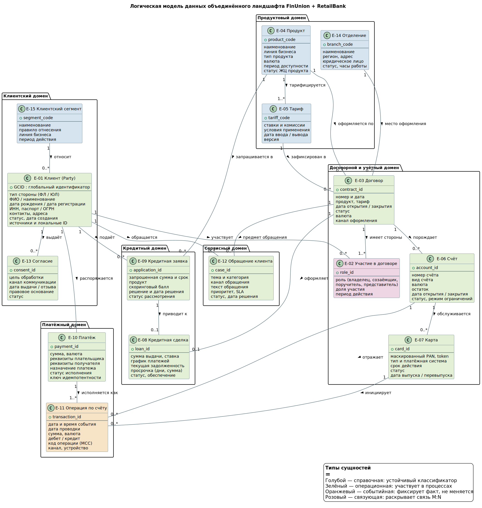
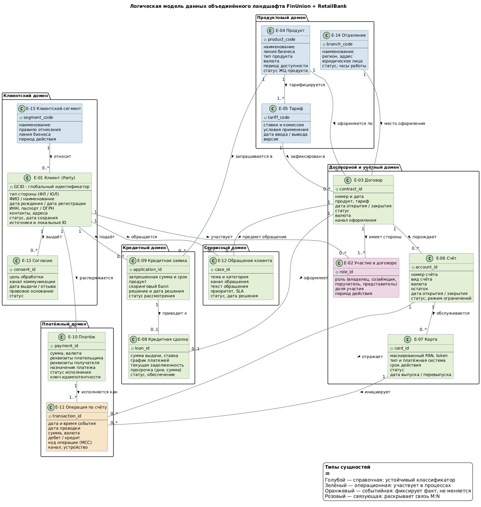

# Логическая модель данных

## 1. Диаграмма

Исходник диаграммы также вынесен в `diagrams/erd.puml`.

## 2. Реестр связей

| ID | Связь | Кардинальность | Обязательность | Смысл |
|---|---|---|---|---|
| R-01 | Клиент — Участие в договоре | 1 : 0..N | Участие без клиента не существует | Клиент может не иметь ни одного договора |
| R-02 | Договор — Участие в договоре | 1 : 1..N | У договора минимум одна сторона | Раскрытие M:N между клиентом и договором |
| R-03 | Продукт — Договор | 1 : 0..N | Договор без продукта недопустим | Продукт используется во множестве договоров |
| R-04 | Продукт — Тариф | 1 : 1..N | Тариф без продукта не существует | Продукт несёт несколько тарифных планов |
| R-05 | Тариф — Договор | 1 : 0..N | Обязательна | В договоре фиксируется версия тарифа на дату оформления |
| R-06 | Отделение — Договор | 1 : 0..N | Опциональна | Договор, оформленный в дистанционном канале, не привязан к отделению |
| R-07 | Сегмент — Клиент | 1 : 0..N | Опциональна | Клиент отнесён к одному действующему сегменту в каждый момент времени |
| R-08 | Клиент — Согласие | 1 : 0..N | Согласие без клиента не существует | У клиента несколько согласий по целям и каналам |
| R-09 | Договор — Счёт | 1 : 0..N | Счёт без договора не существует | Договор порождает один или несколько счетов |
| R-10 | Счёт — Карта | 1 : 0..N | Карта без счёта не существует | К счёту выпускается несколько карт, включая перевыпущенные |
| R-11 | Счёт — Операция | 1 : 0..N | Операция без счёта не существует | По счёту проходит поток проводок |
| R-12 | Карта — Операция | 1 : 0..N | Опциональна | Карточная операция ссылается на карту, безналичный перевод — нет |
| R-13 | Клиент — Платёж | 1 : 0..N | Платёж без инициатора не существует | Клиент создаёт распоряжения на перевод |
| R-14 | Платёж — Операция | 1 : 1..N | Обязательна для исполненного платежа | Одно распоряжение порождает несколько проводок, включая комиссию |
| R-15 | Клиент — Кредитная заявка | 1 : 0..N | Заявка без клиента не существует | Клиент подаёт несколько заявок |
| R-16 | Продукт — Кредитная заявка | 1 : 0..N | Обязательна | Заявка подаётся на конкретный кредитный продукт |
| R-17 | Кредитная заявка — Кредитная сделка | 1 : 0..1 | Опциональна | Заявка может закончиться отказом |
| R-18 | Договор — Кредитная сделка | 1 : 0..1 | Сделка без договора не существует | Кредитный договор оформляет одну сделку |
| R-19 | Клиент — Обращение | 1 : 0..N | Обращение без клиента не существует | Клиент обращается многократно |
| R-20 | Договор — Обращение | 1 : 0..N | Опциональна | Обращение может быть общей консультацией без предмета |

## 3. Архитектурные решения, зафиксированные моделью

- **Связь «клиент — договор» раскрыта через E-02.** Прямая связь 1:N сломалась бы на первом же кредите с созаёмщиком и на первом счёте ЮЛ с несколькими распорядителями. Промежуточная сущность несёт роль, долю и период — это влияет на расчёт обязательств и на выдачу доступа в дистанционных каналах.
- **Карта отделена от счёта.** Перевыпуск карты не закрывает счёт, а блокировка карты не блокирует счёт. Объединение сделало бы невозможным ведение истории статусов, о расхождении которых прямо сказано в описании ландшафта.
- **Платёж отделён от операции.** Распоряжение изменяемо и имеет статус, проводка неизменяема. Разделение даёт точку контроля идемпотентности — без неё повторная отправка платежа через второй канал создаёт двойное списание.
- **Тариф отделён от продукта и фиксируется в договоре.** Условия на дату оформления должны восстанавливаться и через несколько лет — при слиянии это ещё и способ сопоставить продукты двух банков не по названию, а по экономическому содержанию.
- **Заявка отделена от сделки.** Отказные заявки — обязательный материал для скоринга и для регуляторной отчётности по кредитованию; при слиянии моделей риска их отсутствие смещает выборку.
- **Отчётные объекты в модель не вынесены.** Витрины и отчёты — производные аналитического контура, они строятся из перечисленных сущностей и не претендуют на роль источника истины.
