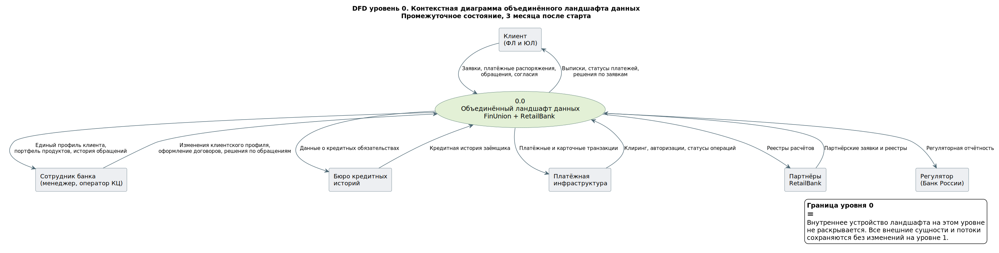
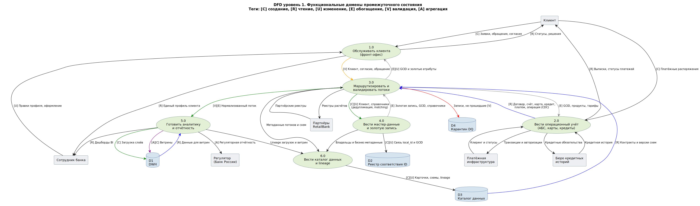
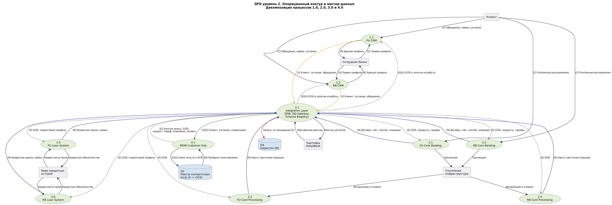
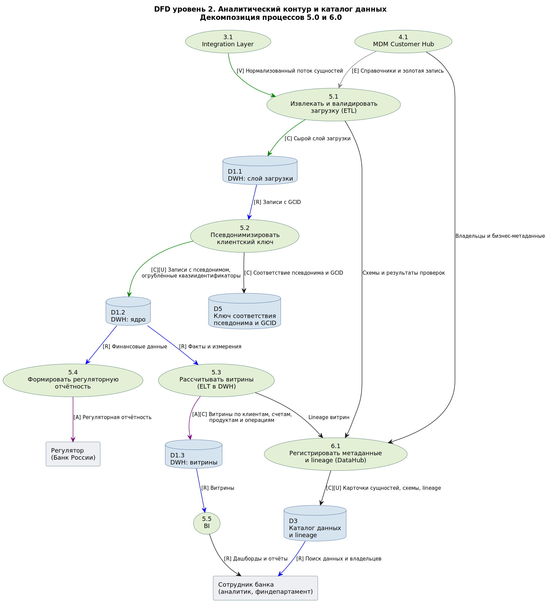

# Потоки данных промежуточного состояния

## 1. Структура диаграмм

Задание требует показать на контекстной диаграмме тринадцать конкретных систем. Контекстный уровень по определению показывает ландшафт единым непрозрачным блоком, а уровень 1 предполагает от трёх до девяти процессов — тринадцать систем не помещаются ни в одно из этих ограничений. Поэтому иерархия разложена на три уровня, и все перечисленные в задании элементы присутствуют на уровне 2:

| Уровень | Что показывает | Файл |
|---|---|---|
| 0 | Ландшафт как единый процесс в окружении внешних сущностей | `diagrams/dfd-level0.png` |
| 1 | Шесть функциональных доменов промежуточного состояния | `diagrams/dfd-level1.png` |
| 2 | Конкретные системы: CRM, АБС, процессинги, кредитные системы, шина, MDM | `diagrams/dfd-level2-operational.png` |
| 2 | Аналитический контур и каталог данных: ETL, DWH, BI, DataHub | `diagrams/dfd-level2-analytical.png` |

Переход между уровнями подчиняется правилам балансировки: внешние сущности уровня 0 сохранены на уровнях 1 и 2 без изменений, новых внешних потоков на нижних уровнях не появляется, а каждый входной поток адресован конкретному домену.

### Уровень 0. Контекстная диаграмма

Контекстный уровень фиксирует границу проектируемого ландшафта и отвечает на вопрос, с кем он обменивается данными. Шесть внешних сущностей: клиент, сотрудник банка, регулятор, бюро кредитных историй, платёжная инфраструктура и партнёры RetailBank. Регуляторная отчётность показана как исходящий поток к внешнему потребителю.

### Уровень 1. Функциональные домены

Шесть доменов: обслуживание клиента, операционный учёт, маршрутизация и валидация потоков, ведение мастер-данных, аналитика и отчётность, каталог данных. На этом уровне вступает в силу правило нотации: данные не перемещаются сами по себе, любая передача идёт через процесс. Поэтому связь CRM и АБС с хранилищами проходит через процесс 3.0, а не напрямую.

### Уровень 2. Операционный контур и мастер-данные

Здесь раскрыты тринадцать систем из задания в операционной части: две CRM, две АБС, два карточных процессинга, две кредитные системы, интеграционный слой и MDM Customer Hub. Добавлены два хранилища, без которых схема была бы неполной: реестр соответствия локальных идентификаторов и карантин записей, не прошедших валидацию.

### Уровень 2. Аналитический контур и каталог данных

Раскрыты DWH со слоями загрузки, ядра и витрин, BI, формирование регуляторной отчётности и DataHub. Отдельным процессом показана псевдонимизация клиентского ключа на входе в аналитический контур — без неё регулируемые данные размножались бы в исходном виде по всем витринам.

## 2. Реестр потоков

Поля потока: источник, приёмник, передаваемые сущности, тип действия, режим обмена, обоснование.

### Клиентский контур и мастер-данные

**F-01. FU CRM → Integration Layer → MDM Customer Hub**
Сущности: E-01 клиент, E-13 согласие, E-12 обращение.
Действие: [V] валидация на шине, затем [C] создание или [U] изменение записи в MDM с дедупликацией.
Режим обмена: асинхронный, событийный, близко к реальному времени.
Обоснование: единый клиентский идентификатор — первое требование промежуточного состояния. Без публикации изменений профиля в MDM золотая запись устаревает в момент создания, а дубли продолжают накапливаться.

**F-02. RB CRM → Integration Layer → MDM Customer Hub**
Сущности, действие и режим — как в F-01.
Обоснование: RetailBank сегодня работает через точечные интеграции без единого подхода к потокам. Перевод клиентского потока на шину — минимальное изменение, дающее сопоставление клиентских баз без замены самой CRM.

**F-03. MDM Customer Hub → Integration Layer → FU CRM и RB CRM**
Сущности: E-01 клиент (золотая запись и GCID).
Действие: [E] обогащение локальной записи глобальным идентификатором, [U] обновление золотых атрибутов.
Режим обмена: асинхронный, публикация изменений подписчикам.
Обоснование: менеджер должен видеть единую картину по клиенту, не переключаясь между двумя CRM. Обратный поток закрывает вторую половину задачи: без него GCID существует только внутри MDM и не помогает фронт-офису.

**F-04. FU Core Banking и RB Core Banking → Integration Layer**
Сущности: E-03 договор, E-02 участие в договоре, E-06 счёт, E-10 платёж, E-11 операция.
Действие: [R] чтение изменений.
Режим обмена: CDC по журналу репликации для FinUnion, ежедневный batch для RetailBank на первом этапе с переводом на CDC внутри переходного периода.
Обоснование: аналитика не должна создавать нагрузку на операционные системы. CDC снимает изменения из журнала репликации, не потребляя ресурсы процессора основной базы и не требуя доработки кода АБС.

**F-05. FU Card Processing и RB Card Processing → Integration Layer**
Сущности: E-07 карта, E-11 операция (карточная).
Действие: [R] чтение.
Режим обмена: потоковый для карточных операций, ежедневный batch для реестра карт и статусов.
Обоснование: карточные операции — высокочастотный поток, который нужен антифроду в близком к реальному времени. Реестр карт меняется медленно, для него потоковая передача избыточна.

**F-06. FU Loan System и RB Loan System → Integration Layer**
Сущности: E-08 кредитная сделка, E-09 кредитная заявка.
Действие: [R] чтение.
Режим обмена: ежедневный batch после закрытия операционного дня.
Обоснование: кредитный портфель рассчитывается на конец дня, внутридневная актуальность не требуется ни отчётности, ни риск-менеджменту. Batch дешевле в поддержке и не нагружает кредитные системы в рабочие часы.

**F-07. FU CRM, RB CRM, продуктовые подразделения → Integration Layer → MDM**
Сущности: E-04 продукт, E-05 тариф, E-14 отделение, E-15 сегмент.
Действие: [C] создание и [U] изменение справочных записей.
Режим обмена: асинхронный по событию изменения справочника.
Обоснование: несинхронизированные справочники названы в кейсе прямой причиной расхождения отчётности. Сведение их в MDM — условие того, чтобы витрины двух банков вообще суммировались.

**F-08. MDM → Integration Layer → АБС, процессинги, кредитные системы**
Сущности: E-01 клиент (GCID), E-04 продукт, E-05 тариф, E-14 отделение, E-15 сегмент.
Действие: [E] обогащение, [R] чтение справочников.
Режим обмена: асинхронная публикация изменений, локальный кеш справочника на стороне потребителя.
Обоснование: операционные системы должны проставлять GCID в новых записях, иначе сопоставление придётся выполнять повторно на каждой загрузке в аналитический контур.

**F-09. Integration Layer → Карантин DQ**
Сущности: любые, не прошедшие валидацию.
Действие: [C] создание записи о дефекте с указанием правила и источника.
Режим обмена: асинхронный, в момент отбраковки.
Обоснование: выбор между отклонением всей загрузки, карантином и загрузкой с флагом — архитектурное решение. Для клиентских и справочных данных выбран карантин: дефектная запись не блокирует остальную загрузку, но и не попадает в золотую запись молча.

### Аналитический контур

**F-10. Integration Layer → процесс 5.1 → DWH, слой загрузки**
Сущности: все пятнадцать в нормализованном виде.
Действие: [V] проверка соответствия контракту, [C] создание записей в сыром слое.
Режим обмена: микро-batch с интервалом в пределах часа для операционных сущностей, ежедневный batch для справочников.
Обоснование: сырой слой нужен для повторной обработки и восстановления происхождения данных. Без него любая ошибка трансформации требует повторного обращения к системам-источникам.

**F-11. DWH слой загрузки → процесс 5.2 → DWH ядро**
Сущности: все сущности, содержащие клиентский ключ.
Действие: [C] создание записей с псевдонимом, [U] огрубление квазиидентификаторов.
Режим обмена: batch в составе загрузки.
Обоснование: аналитический контур копирует регулируемые данные, а значит, размножает их. Псевдонимизация сохраняет связность между операциями, договорами и обращениями, но делает прямую идентификацию невозможной. Ключ соответствия хранится в отдельном контуре — если он лежит рядом с данными и доступен тем же людям, правовой режим не снижается.

**F-12. DWH ядро → процесс 5.3 → DWH витрины**
Сущности: агрегаты по клиентам, счетам, продуктам и операциям.
Действие: [R] чтение фактов и измерений, [A] агрегация, [C] создание витрины.
Режим обмена: ночной batch по расписанию, трансформация средствами самого хранилища.
Обоснование: расчёт внутри хранилища выбран потому, что целевой аналитический контур строится на масштабируемом кластере, а витрины придётся пересобирать по мере сопоставления продуктовых линеек двух банков. Пересборка из сырого слоя дешевле повторного обращения к источникам.

**F-13. DWH витрины → BI**
Сущности: витрины управленческой отчётности.
Действие: [R] чтение.
Режим обмена: синхронный запрос по обращению пользователя.
Обоснование: минимальный набор витрин для BI — требование промежуточного состояния. Чтение идёт из витринного слоя, а не из ядра, чтобы пользовательские запросы не конкурировали с расчётом.

**F-14. DWH ядро → процесс 5.4 → Регулятор**
Сущности: E-03 договор, E-06 счёт, E-08 кредитная сделка, E-11 операция.
Действие: [R] чтение, [A] агрегация по формам отчётности.
Режим обмена: batch по регламенту сдачи отчётности.
Обоснование: регламентированная отчётность строится из ядра, а не из витрин: витрины оптимизированы под управленческие разрезы и могут не совпадать с методикой регулятора.

### Каталог данных

**F-15. Integration Layer, MDM, процессы загрузки → DataHub → Каталог данных**
Сущности: метаданные — схемы контрактов, владельцы, результаты проверок качества, lineage.
Действие: [C] создание и [U] обновление карточек.
Режим обмена: асинхронный по событию публикации схемы или завершения загрузки.
Обоснование: каталога данных нет ни у одного из банков — это пробел, обнаруженный при раскладке систем по доменам. Без lineage невозможно ответить, кто пострадает от изменения схемы, а анализ влияния перед рефакторингом выполнить нечем.

**F-16. Каталог данных → Integration Layer**
Сущности: контракты и версии схем.
Действие: [R] чтение при валидации.
Режим обмена: синхронный вызов при публикации сообщения и при развёртывании изменений.
Обоснование: валидация по схеме на шине превращает контракт из документа в исполняемое правило. Без обращения к реестру схем проверка держится на коде конкретного адаптера и расходится с документацией.

### Внешние потоки

**F-17. Кредитные системы ↔ Бюро кредитных историй**
Сущности: E-09 кредитная заявка (запрос), кредитная история заёмщика (ответ).
Действие: [R] чтение, [E] обогащение заявки.
Режим обмена: синхронный запрос при рассмотрении заявки.
Обоснование: решение по заявке зависит от ответа, поэтому асинхронный режим здесь неприменим. В переходный период оба банка сохраняют свои договоры с бюро.

**F-18. АБС и процессинги ↔ Платёжная инфраструктура**
Сущности: E-10 платёж, E-11 операция.
Действие: [C] создание операций по результатам авторизации и клиринга.
Режим обмена: синхронный для авторизаций, batch для клиринговых файлов.
Обоснование: поток внешний по отношению к периметру проекта и в переходный период не меняется. Зафиксирован на диаграмме, чтобы при миграции карточного портфеля было видно, какие внешние договорённости придётся переоформлять.

## 3. Проверка диаграммы на типовые ошибки

| Антипаттерн | Признак | Результат проверки |
|---|---|---|
| Чёрная дыра | В процесс или хранилище входят потоки, но ни один не выходит | Не обнаружено. Карантин DQ (D4) — единственный кандидат: из него нет автоматического исходящего потока, но есть процесс ручного разбора с ответственным стюардом, зафиксированный в правилах владения. Если такой процесс не запустить, D4 станет чёрной дырой в буквальном смысле |
| Чудо | Из процесса выходят данные, но ни один поток в него не входит | Не обнаружено. У каждого процесса расчёта витрин и отчётности есть явный входящий поток из ядра DWH |
| Серый карлик | Входящих данных недостаточно для формирования исходящего потока | Проверен процесс 5.3: для расчёта витрин по продуктовым разрезам недостаточно фактов из ядра, поэтому добавлен поток справочников из MDM через процесс 5.1 |
| Паутина вокруг базы | Несколько систем читают и пишут напрямую в чужую базу | Устранено в целевом решении: доступ к данным других систем идёт только через интеграционный слой. В состоянии As-Is этот антипаттерн присутствует в виде прямых batch-выгрузок из АБС и точечных интеграций RetailBank |
| Тяжеловес на тонком льду | Аналитическая нагрузка идёт в операционную СУБД | Устранено: выгрузка в аналитический контур идёт через CDC и шину, прямых аналитических запросов к АБС на диаграмме нет |
| Голая труба | Поток идёт от источника к потребителю без проверки контракта | Устранено: каждый входящий в шину поток проходит [V] с проверкой по реестру схем |
| Слепая зона | Поток уходит к неизвестному потребителю | Частично: точечные интеграции RetailBank с партнёрами до инвентаризации остаются слепой зоной. Зафиксировано как риск D-09 в перечне проблемных зависимостей |
