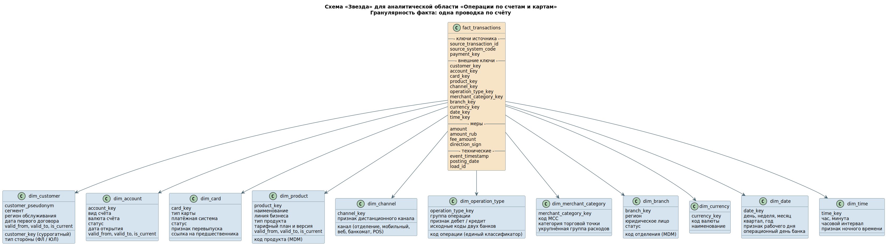

# Аналитическая модель

## 1. Выбранная область и схема

Аналитическая область — **операции по счетам и картам**. Выбрана потому, что это самая объёмная область объединённого ландшафта, она обслуживает наибольшее число потребителей (управленческая отчётность, риск, антифрод, продуктовые подразделения) и именно в ней расхождения между двумя банками проявляются в цифрах.

Схема — **«Звезда»**. Таблица фактов в центре, измерения подключаются к ней напрямую, без промежуточных справочных таблиц.

## 2. Гранулярность

**Одна строка факта — одна проводка по счёту.**

Это решение принимается первым, до состава полей, и отвечает на три вопроса:

| Вопрос | Ответ для этой области |
|---|---|
| Какое событие анализирует бизнес | Факт движения средств: списание, зачисление, комиссия, начисление процентов, карточная операция |
| На каком уровне источник гарантирует уникальность и аудит | Проводка в АБС и карточная операция в процессинге неизменяемы после создания и имеют собственный идентификатор в системе-источнике |
| Какие отчёты должны строиться без дублей | Обороты по счетам, структура расходов по категориям торговых точек, активность по каналам, комиссионный доход по продуктам |

Что сюда сознательно не смешивается: распоряжения на перевод и остатки на конец дня. Платёж — это распоряжение с изменяемым статусом, которое может породить несколько проводок или быть отклонённым. Если положить платежи и проводки в одну таблицу фактов, обороты задвоятся ровно на величину комиссий. Остаток на конец дня — состояние, а не событие, и требует отдельной таблицы периодических снимков.

Связь с платежом сохраняется через `payment_key` в факте: из проводки всегда видно, каким распоряжением она порождена, но одна проводка остаётся одной строкой.

## 3. Состав таблицы фактов

| Группа полей | Поля | Назначение |
|---|---|---|
| Ключи источника | `source_transaction_id`, `source_system_code`, `payment_key` | Трассировка до системы-источника, связь с распоряжением, основа дедупликации при повторной загрузке |
| Внешние ключи измерений | `customer_key`, `account_key`, `card_key`, `product_key`, `channel_key`, `operation_type_key`, `merchant_category_key`, `branch_key`, `currency_key`, `date_key`, `time_key` | Построение срезов без дублирования логики соединений |
| Меры | `amount`, `amount_rub`, `fee_amount`, `direction_sign` | Суммы в валюте операции и в рублях по курсу на дату, комиссия, признак дебета или кредита |
| Технические | `event_timestamp`, `posting_date`, `load_id` | Время события и дата проводки хранятся раздельно, идентификатор загрузки нужен для повторного запуска |

Раздельное хранение времени события и даты проводки — не избыточность. Карточная операция совершается в одно время, а проводится в другое, иногда на следующий день. Отчёт по активности клиента строится по времени события, отчёт по оборотам — по дате проводки. Слияние этих полей в одно даёт расхождение между двумя отчётами, которое невозможно объяснить.

## 4. Измерения

| Измерение | Состав | Комментарий |
|---|---|---|
| `dim_customer` | Суррогатный ключ, псевдоним клиента, тип стороны, сегмент, регион обслуживания, дата первого договора, интервал действия версии | Содержит псевдоним, а не GCID: аналитический контур работает на псевдонимизированном ключе |
| `dim_account` | Вид счёта, валюта, статус, дата открытия, интервал действия версии | Версионируется: изменение вида счёта не должно менять исторические отчёты |
| `dim_card` | Тип карты, платёжная система, статус, признак перевыпуска, ссылка на предшественника | Ссылка на предшественника позволяет собрать историю по физической карте через несколько перевыпусков |
| `dim_product` | Код продукта из MDM, наименование, линия бизнеса, тип продукта, тарифный план и версия, интервал действия версии | Единственный источник — справочник MDM, локальные коды двух банков сюда не попадают |
| `dim_channel` | Отделение, мобильное приложение, веб, банкомат, POS, признак дистанционного канала | Разрез, по которому оценивается перевод клиентов RetailBank на каналы FinUnion |
| `dim_operation_type` | Код операции по единому классификатору, группа операции, признак дебета или кредита, исходные коды двух банков | Исходные коды сохраняются в измерении: без них невозможно проверить корректность словаря соответствия |
| `dim_merchant_category` | Код категории торговой точки, категория, укрупнённая группа расходов | Основа анализа потребительского поведения и части антифрод-сценариев |
| `dim_branch` | Код отделения из MDM, регион, юридическое лицо, статус | Региональная отчётность после объединения сетей двух банков |
| `dim_currency` | Код и наименование валюты | Вынесено отдельно, потому что используется и в фактах, и в измерении счёта |
| `dim_date` | День, неделя, месяц, квартал, год, признак рабочего дня, операционный день банка | Операционный день банка не совпадает с календарным — отдельный атрибут, а не расчёт в отчёте |
| `dim_time` | Час, минута, часовой интервал, признак ночного времени | Нужен антифроду и анализу нагрузки на каналы; вынесен из `dim_date`, иначе календарное измерение разрастётся на порядки |

**Бизнес-ключ и суррогатный ключ.** Бизнес-ключ приходит из источника: номер счёта, код продукта из MDM, идентификатор карты в процессинге. Суррогатный ключ создаётся в аналитической модели и связывает факт с нужной версией измерения. Для объединения двух банков это критично: один и тот же продукт до сопоставления справочников имел разные коды, и без суррогатного ключа перепривязка фактов при уточнении сопоставления потребовала бы перестройки всей витрины.

## 5. Почему «Звезда» подходит для этой OLAP-нагрузки

**Аудитория витрины широкая.** Управленческая отчётность, продуктовые подразделения, риск, контактный центр. Плоская структура понятна без объяснений: один факт, вокруг него измерения, каждое подключается напрямую. «Снежинка» с нормализованной продуктовой иерархией потребовала бы от пользователя понимать, на каком уровне иерархии соединять таблицы, а ошибка в выборе уровня даёт правдоподобный, но неверный результат.

**Меньше соединений на запрос.** Типичный запрос — сумма оборотов по продукту, региону и месяцу — требует четырёх соединений при «Звезде» и семи-восьми при нормализованной иерархии. Для колоночного хранилища, где данные сканируются большими массивами, каждое дополнительное соединение стоит заметно.

**Измерения здесь не настолько сложны, чтобы оправдать нормализацию.** Продуктовая иерархия объединённого банка — два-три уровня: линия бизнеса, тип продукта, продукт. Это помещается в одну денормализованную таблицу без потери управляемости. Нормализация оправдана там, где иерархии развиваются независимо друг от друга и их много.

**Риск денормализации закрывается организационно, а не структурно.** Главная претензия к «Звезде» — измерения денормализованы, атрибуты дублируются по витринам, справочники начинают расходиться. В этой архитектуре источник всех справочных атрибутов один: MDM. Измерение собирается из него и ниоткуда больше, а согласованные измерения переиспользуются несколькими витринами, а не создаются заново под каждую.

## 6. Решения, которые остаются за рамками схемы

Схема не отвечает на четыре вопроса, и оставлять их внутри отдельных BI-отчётов нельзя:

| Вопрос | Решение для этой области |
|---|---|
| Как хранить изменения атрибутов измерений | Версионирование с интервалами действия для `dim_customer`, `dim_account`, `dim_product`. Смена сегмента клиента не должна менять отчёты прошлых периодов |
| Нужны ли снимки состояния | Да, отдельной таблицей периодических снимков остатков на конец дня. В таблицу проводок она не смешивается |
| Как моделировать связи «многие ко многим» | Участие нескольких клиентов в одном договоре — связь M:N. Решается мостовой таблицей между фактом и измерением клиента, а не дублированием строк факта |
| Где определяются формулы показателей | В семантическом слое, а не в BI-отчётах. У каждого критичного показателя есть подразделение, утверждающее определение, витрина-источник и ответственный за исправление ошибки |

Последняя строка важнее остальных. Самая опасная проблема аналитического контура — не медленный запрос, а правдоподобный, но неверный показатель: он используется месяцами, прежде чем кто-то замечает задвоение. Признак того, что модель спроектирована, а не нарисована: по каждому показателю можно объяснить, из каких источников он получен, на каком уровне детализации рассчитан, кто отвечает за его смысл и что произойдёт при повторной загрузке.
