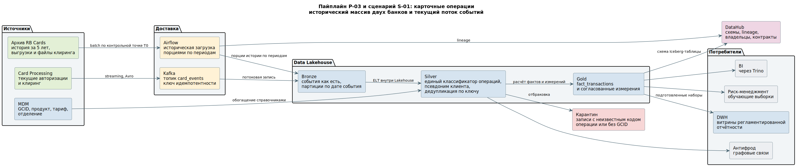

# Пайплайны данных

## 1. Реестр пайплайнов

| ID | Пайплайн | Источник | Приёмник | Тип | Инструменты | Горизонт |
|---|---|---|---|---|---|---|
| P-01 | Управленческая отчётность на PostgreSQL | Core Banking обоих банков, CRM обоих банков | DWH: staging → core → витрины | ETL | Airflow, SQL | 3 месяца |
| P-02 | Золотая запись клиента | FU CRM, RB CRM, обе АБС | MDM Customer Hub | Потоковая загрузка с дедупликацией | Kafka, Integration Layer, движок matching MDM | 3 месяца |
| P-03 | Карточные и платёжные операции | Card Processing обоих банков, Core Banking | Lakehouse: bronze → silver → gold | Streaming на приёме, ELT между слоями | Kafka, Iceberg, Trino, Airflow | 6–12 месяцев |
| P-04 | Регламентированная отчётность регулятору | DWH core, подготовленные наборы silver | Витрина отчётности, выгрузка регулятору | ELT + пакетная выгрузка | Airflow, SQL, семантический слой | 6 месяцев |
| P-05 | Миграция исторических данных RetailBank | Архивные выгрузки RB Core, RB Cards, RB Loans, RB DWH | Объектное хранилище → Lakehouse bronze → silver | Разовая историческая загрузка порциями плюс поток дельты | Airflow, Iceberg, CDC | 6–12 месяцев |
| P-06 | Метаданные и происхождение данных | Integration Layer, MDM, Airflow, Iceberg | DataHub | Событийная публикация метаданных | DataHub, коннекторы к Airflow и каталогу таблиц | 3–6 месяцев |

## 2. P-01. Простой пайплайн для DWH на PostgreSQL, промежуточное состояние

Это минимальный работоспособный пайплайн, который закрывает требование единой управленческой отчётности через три месяца. Он сознательно устроен просто: один DAG, линейная последовательность задач, трансформации на SQL.

**Источники.** Core Banking обоих банков — договоры, счета, операции. CRM обоих банков — клиенты и обращения. MDM — справочники продуктов, тарифов, отделений, сегментов и реестр соответствия идентификаторов.

**Приёмник.** DWH со слоями staging, core и витрин.

**Расписание.** Ежедневно после закрытия операционного дня, готовность витрин до 07:00.

**Состав DAG.** Задачи выполняются линейно, каждая следующая стартует после успешного завершения предыдущей:

1. Сенсор ожидает появления выгрузок за операционный день.
2. Извлечение в staging: данные сохраняются в исходном или почти исходном виде, проверяются структура и полнота порции.
3. Валидация порции: количество записей сверяется с источником, проверяются обязательные поля.
4. Загрузка в core: сопоставление справочников, приведение валют и статусов, присвоение внутренних ключей.
5. Расчёт витрин: агрегация до уровня отчётных разрезов.
6. Проверка контрольных показателей: сверка витрины с core и с данными АБС.
7. Публикация метаданных и происхождения в каталог.

**Правила перехода из staging в core.** Это и есть содержательная часть пайплайна, которую нужно зафиксировать до написания кода:

| Данные staging | Данные core | Правило |
|---|---|---|
| source_customer_id, source_system_code | customer_key | Найти клиента в реестре соответствия по GCID; при отсутствии — в карантин |
| source_product_code, source_system_code | product_key | Найти продукт в таблице соответствия справочников MDM |
| amount, currency_code | amount_rub | Пересчитать по курсу на дату операции |
| source_status | unified_status | Привести локальный статус к единой статусной модели объединённой компании |
| source_contract_id | source_contract_id | Сохранить исходный идентификатор для трассировки до источника |

**Поведение при повторной загрузке.** Каждая порция получает идентификатор загрузки. Повторный запуск за тот же период выполняет вставку или обновление по стабильному бизнес-ключу, а не добавление новых строк. Без этого перезапуск после сбоя начинает наращивать суммы в отчётах.

**Обработка дефектных записей.** Записи, для которых не найден клиент, продукт или курс валюты, направляются в карантин с указанием нарушенного правила и системы-источника. Молча исключать их нельзя: расхождение витрины с бухгалтерией обнаружится позже и без объяснения причины.

**Опоздавшие данные.** Возвраты, сторнирующие проводки и исправления, поступившие после закрытия периода, попадают в окно перерасчёта: последние тридцать дней пересчитываются при каждом запуске. Выборка только по дате создания записи пропустила бы их.

## 3. P-02. Золотая запись клиента

**Источник.** FU CRM, RB CRM, обе АБС.
**Приёмник.** MDM Customer Hub, реестр соответствия локальных идентификаторов.
**Тип.** Потоковая загрузка через шину с валидацией по схеме и дедупликацией в MDM.
**Инструменты.** Kafka, Integration Layer с реестром схем, движок сопоставления MDM.

Особенность: результат сопоставления не бинарный. Пары с высокой уверенностью сливаются автоматически, неоднозначные изолируются в карантине и попадают на разбор стюарду клиентских данных. Автоматический выбор победителя по времени изменения не применяется: некорректное слияние не вызывает технической ошибки и расходится по всем системам-потребителям.

## 4. P-04. Регламентированная отчётность

**Источник.** Согласованный слой DWH, подготовленные наборы серебряного слоя Lakehouse.
**Приёмник.** Витрина отчётности, выгрузка в форматах регулятора.
**Тип.** ELT внутри хранилища, затем пакетная выгрузка по регламенту.
**Инструменты.** Airflow, SQL, семантический слой.

Особенность: отчёт формируется из согласованного слоя, а не из управленческих витрин. Управленческие разрезы оптимизированы под вопросы бизнеса и могут не совпадать с методикой регулятора. Двойная сверка — с согласованным слоем и с данными АБС — выполняется до выгрузки, допустимое расхождение нулевое. Готовность отчёта — не позднее срока регламента минус два рабочих дня, чтобы оставалось время на разбор расхождений.

## 5. P-05. Миграция исторических данных RetailBank

**Источник.** Архивные выгрузки RB Core, RB Cards, RB Loans, RB DWH.
**Приёмник.** Объектное хранилище, далее бронзовый и серебряный слои Lakehouse.
**Тип.** Разовая историческая загрузка порциями плюс непрерывный поток изменений.
**Инструменты.** Airflow, Iceberg, CDC.

Устройство пайплайна определяется тем, что системы-источники продолжают работать во время переноса. Сначала фиксируется контрольная точка: данные, созданные или изменённые до неё, относятся к исторической загрузке, всё последующее идёт отдельным потоком дельты. История переносится порциями по периодам и продуктовым сегментам, чтобы повторить можно было только проблемный фрагмент, а не весь перенос.

Три вещи, которые ломают такой пайплайн чаще всего и учтены в конструкции:

- **Поле даты изменения не всегда обновляется.** Оно может не меняться при обновлении дочерних таблиц, массовой загрузке или ручном исправлении напрямую в базе. До выбора механизма инкремента выполняется проверка: запись изменяется несколькими типовыми способами, и проверяется, зафиксировал ли источник каждое изменение.
- **Перенос только новых и изменённых записей оставляет мусор.** Отменённый договор или деактивированная карта останутся активными в целевом контуре. Для каждого способа, которым источник сообщает об удалении — физическое удаление, признак, новый статус, событие — заранее определено, как это отражается в целевой модели.
- **Повторные запуски неизбежны.** Одна и та же порция должна обрабатываться повторно без появления дублей и без изменения уже подтверждённого результата. Используются стабильные ключи, вставка с обновлением и журнал обработанных пакетов.

## 6. Сценарии больших исторических и событийных данных

### S-01. История карточных операций двух банков

| Поле | Значение |
|---|---|
| Источник данных | FU Cards и RB Cards: текущие авторизации и клиринг; архивные выгрузки карточных операций RetailBank за прошлые годы; файлы клиринга платёжной инфраструктуры |
| Характер данных | Событийные для текущего потока, исторические и архивные для массива прошлых лет, полуструктурированные в части файлов клиринга и выгрузок с разной структурой у двух процессингов |
| Целевое хранилище | Data Lakehouse: bronze для событий как есть, silver для приведённых к единому классификатору, gold для витрины fact_transactions. Объектное хранилище как физический слой |
| Способ обработки | Streaming на приёме текущего потока через Kafka, batch порциями по периодам для истории, ELT между слоями внутри Lakehouse, CDC для дельты после контрольной точки |
| Потребители | BI через Trino, риск-менеджмент (обучающие выборки), антифрод (связи по устройствам и реквизитам), регуляторная отчётность через подготовленные наборы в DWH |

Ключевое архитектурное решение сценария: коды операций двух процессингов различаются, поэтому единый классификатор применяется на переходе из бронзового слоя в серебряный, а не при загрузке в бронзовый. Бронзовый слой хранит исходные коды — иначе при обнаружении ошибки в словаре соответствия пересчитать историю будет не из чего.

Второе решение: дедупликация по ключу идемпотентности выполняется в серебряном слое. В бронзовом дубли допускаются, потому что потоковая доставка даёт гарантию «не менее одного раза» и повторы неизбежны.

### S-02. События клиентских каналов

| Поле | Значение |
|---|---|
| Источник данных | Мобильное приложение и веб-приложение FinUnion, дистанционные каналы RetailBank, события авторизации и навигации, события создания заявок и обращений |
| Характер данных | Событийные, полуструктурированные; схема меняется вместе с релизами приложений |
| Целевое хранилище | Data Lakehouse, бронзовый слой с партиционированием по дате события, серебряный слой с приведённой схемой |
| Способ обработки | Streaming через Kafka, ELT между слоями, без загрузки в DWH |
| Потребители | Продуктовые подразделения (анализ пути клиента), риск-менеджмент (поведенческие признаки для скоринга), антифрод (нетипичные сессии), аналитика качества обслуживания |

Эти данные сознательно не попадают в DWH. Их схема меняется с каждым релизом приложения, поэтому фиксированная модель хранилища потребовала бы правки при каждом изменении в мобильном клиенте. Гибкая схема — именно тот случай, ради которого в архитектуре есть второй контур.

Ограничение: события содержат идентификаторы устройств и сессий, которые в сочетании с временными метками дают квазиидентификаторы. Псевдонимизация клиентского ключа на переходе в серебряный слой обязательна, а перед публикацией набора для продуктовых подразделений выполняется проверка на уникальность записей по набору квазиидентификаторов.

## 7. Общие правила для всех пайплайнов

- **Разделение DAG по дата-продуктам, а не по системам.** Объединение процессов разных команд в один DAG связывает расписания, релизы и сбои независимых продуктов. Зависимости между DAG оформляются через согласованные наборы данных и критерии их готовности.
- **Идемпотентность как обязательное свойство.** Любой пайплайн должен переживать повторный запуск за тот же период без появления дублей и без изменения подтверждённого результата.
- **Карантин вместо молчаливого пропуска.** Запись, не прошедшая проверку, помещается в карантин с зафиксированной причиной. Стратегия выбирается по цене ошибки: для клиентских и справочных данных карантин, для финансовых показателей — отклонение всей порции.
- **Проверка ближе к источнику дешевле.** Дефект, пойманный на форме ввода, стоит одного диалогового окна. Тот же дефект на загрузке в хранилище — разбирательства с владельцем системы-источника. Он же в витрине — перепроведения отчётности.
- **Публикация метаданных — часть пайплайна, а не отдельная активность.** Каждый DAG публикует происхождение данных в каталог по завершении. Lineage, который поддерживается вручную, устаревает за недели.
