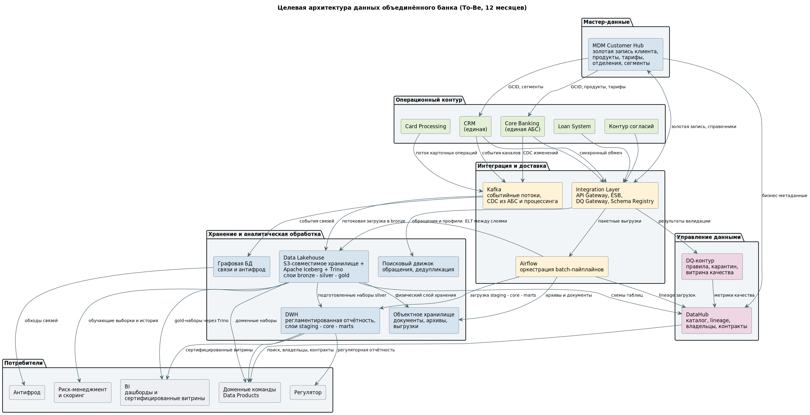

# Целевая архитектура данных, To-Be через 12 месяцев

## 1. Диаграмма

Архитектура разделена на шесть зон. Разделение проходит не по технологиям, а по типу нагрузки и режиму доступа: операционный контур обслуживает транзакции, аналитический — сканы и агрегации, контур управления данными не хранит значения, только метаданные.

## 2. Состав компонентов

| Компонент | Назначение в целевой архитектуре | Что размещается | Почему выбран этот класс решения |
|---|---|---|---|
| Operational Systems: Core Banking, CRM, Card Processing, Loan System, контур согласий | Ведение операционных сущностей и их жизненного цикла | E-02, E-03, E-06, E-07, E-08, E-09, E-10, E-11, E-12, E-13 | Транзакционный профиль нагрузки: точечные чтения и записи, короткие транзакции, жёсткие требования к целостности. Реляционная СУБД, изменение схемы через релиз — приемлемая цена при стабильной модели банковского учёта |
| MDM Customer Hub | Золотая запись клиента и справочные данные | E-01 клиент, E-04 продукт, E-05 тариф, E-14 отделение, E-15 сегмент, реестр соответствия локальных идентификаторов | Справочные данные с редкими изменениями, понятным владельцем и требованием единой версии. Профиль дедупликации и сопоставления записей, под который MDM и создан. Учётные сущности сюда не переносятся |
| Integration Layer: API Gateway, ESB, DQ Gateway, Schema Registry | Синхронный обмен, маршрутизация по содержимому, валидация по контракту | Контракты и версии схем, правила маршрутизации, карантин отбракованных записей | Точечные интеграции RetailBank без единого подхода к потокам — исходная проблема ландшафта. Шина заменяет спагетти-связи одной точкой маршрутизации и превращает контракт из документа в исполняемое правило |
| Kafka | Событийные потоки и доставка изменений из операционных систем | Карточные операции, события клиентских каналов, CDC-поток из АБС, события изменения золотой записи | Аналитика не должна нагружать операционные системы. Чтение журнала репликации не потребляет ресурсы основной базы и не требует доработки кода АБС |
| Airflow | Оркестрация batch-пайплайнов: расписание, зависимости, повторные запуски, пересчёт истории | DAG загрузки в DWH, DAG перехода между слоями Lakehouse, DAG миграции истории RetailBank | Пайплайны имеют зависимости и требуют идемпотентного повторного запуска при сбое. DAG разделены по дата-продуктам, а не по системам: иначе релизы и сбои независимых продуктов окажутся связаны |
| DWH: слои staging, core, marts, семантический слой | Регламентированная отчётность и управленческие витрины | E-03, E-06, E-08, E-10, E-11 в согласованной модели, витрины по клиентам, счетам, продуктам и операциям | Структурированные согласованные данные, стабильный набор отчётов, требование воспроизводимости показателя на дату. Точечные обновления в колоночном хранилище дороги, но регламентированная отчётность загружается пакетно и не правится по одной записи |
| Data Lakehouse: объектное хранилище, Apache Iceberg, Trino, слои bronze, silver, gold | Большие исторические и событийные данные, обучающие выборки, эксперименты | Полная история операций двух банков, события каналов, архивные выгрузки RetailBank, наборы для скоринга и антифрода | Разнородные схемы, повторная обработка истории, отделение хранения от вычислений. Iceberg даёт управляемую таблицу поверх файлов, Trino — SQL-доступ без переноса данных в отдельную СУБД |
| Объектное хранилище | Документы, вложения, архивы, выгрузки | Сканы договоров, вложения к обращениям, архивные наборы, резервные копии | Запись один раз, чтение редко, большой объём, дешёвое долговременное хранение. Служит физическим слоем для Lakehouse |
| Графовая БД | Связи клиентов и контрагентов, антифрод | Связи по созаёмщикам, поручителям, платёжным реквизитам, устройствам, бенефициарам ЮЛ | Обход связей на три-четыре шага за секунду не даёт ни реляционная, ни колоночная СУБД. Узлы идентифицируются токенами: граф с исходными значениями — готовая к выгрузке социальная сеть клиентской базы |
| Поисковый движок | Полнотекстовый поиск по обращениям, нечёткий поиск клиента | Индекс обращений, индекс клиентских записей для дедупликации | Сопоставление клиентских баз двух банков требует поиска по неточному совпадению, что SQL-запросом к АБС не решается. Индекс не является мастером и допускает задержку синхронизации |
| DataHub | Каталог данных, lineage, владельцы, контракты, бизнес-глоссарий | Карточки сущностей, схемы, результаты проверок качества, происхождение витрин | Каталога нет ни у одного из банков. Без lineage анализ влияния перед изменением схемы выполнить нечем, а список потребителей сущности остаётся неизвестным |
| DQ-контур | Хранилище правил, движок прогона, витрина качества с порогами, карантин | Правила валидации, метрики по пяти измерениям, очередь разбора | Метрика без порога и без ответственного за разбор карантина — график, а не метрика. Контур сквозной, а не отдельная система |
| BI и семантический слой | Дашборды и сертифицированные витрины | Витрины DWH, gold-наборы Lakehouse через Trino | BI остаётся потребителем и не является местом, где заново определяются правила расчёта критичных показателей. Единая формула фиксируется в семантическом слое и имеет владельца |

## 3. Принципы, на которых держится архитектура

**Разделение контуров по типу нагрузки.** В состоянии As-Is batch-выгрузки идут напрямую из АБС и процессинга, то есть ограничение кейса о недопустимости аналитической нагрузки на операционные системы нарушается уже сегодня. В целевом состоянии единственный путь данных из операционного контура в аналитический — через Kafka и шину.

**Режим доступа определяется до профиля нагрузки.** Медленную архитектуру можно ускорить репликой, индексами или железом. Архитектуру с нарушенным правовым режимом можно только переделать. Поэтому псевдонимизация клиентского ключа выполняется на входе в аналитический контур, а ключ соответствия живёт в отдельном контуре с собственной моделью доступа и журналом обращений.

**Мастерство остаётся в профильных системах.** MDM берёт клиентские и справочные данные. Счета, договоры, карты, кредитные сделки, платежи и операции остаются в операционных системах: там они рождаются, там логика их изменения и учётная первичность. DWH и Lakehouse не являются мастерами ни для одной операционной сущности — они потребители и могут быть авторитетным источником только для агрегатов.

**Каждая копия данных наследует режим оригинала.** Реплики, резервные копии, журналы репликации, снапшоты для тестовых стендов, логи медленных запросов с телом запроса внутри — всё это копии регулируемых данных со своими правилами хранения и удаления. Вопрос «сколько копий этих данных существует и одинаковый ли у них режим» входит в чек-лист архитектурного ревью.

**Публикация данных идёт через контракт, а не через прямой доступ к базе.** Ни одна система не подключается к чужой базе напрямую. Схема таблиц — внутреннее устройство системы, а не публичный интерфейс: переименование колонки в источнике не должно ломать пайплайн потребителя.

## 4. Что выводится из эксплуатации

| Компонент As-Is | Решение | Условие вывода |
|---|---|---|
| RB CRM | Отключение после перевода контактного центра и клиентской базы на единую CRM | Все обращения и клиентские записи перенесены, точечные интеграции переключены, журнал запросов к системе пуст в течение контрольного периода |
| RB Core Banking | Отключение после миграции договорного и счётного портфеля | Параллельный прогон и сверка остатков без расхождений, все потребители переключены на единую АБС |
| RB Card Processing | Отключение после перевода карточного портфеля | Перевыпуск или миграция токенов завершены, внешние договорённости с платёжной инфраструктурой переоформлены |
| RB Loan System | Отключение после переноса кредитного портфеля | Задолженность зафиксирована на контрольную дату и сверена, методика расчёта просрочки приведена к единой |
| RB DWH и RB BI | Отключение после переноса отчётности в единый DWH | Проанализированы журналы SQL-запросов, BI-модели, подключения и задания планировщиков. Опрос владельцев отчётности даёт неполный результат: один забытый потребитель блокирует вывод системы уже после переключения |
| Точечные интеграции RetailBank | Перевод на шину или отключение | Каждая интеграция инвентаризирована, владелец и потребитель зарегистрированы в каталоге |
| Частичный Data Lake FinUnion | Поглощение слоем bronze целевого Lakehouse | Данные перенесены под управление Iceberg, каждый набор получил владельца, схему и правила публикации |

## 5. Что остаётся за рамками этого документа

Решения, которые не меняют базовую схему, но влияют на стоимость, производительность и сопровождаемость, и должны быть приняты на следующем шаге проектирования:

- правила партиционирования таблиц Lakehouse и целевой размер файлов, порядок объединения мелких файлов;
- выбор и отказоустойчивость каталога метаданных Iceberg;
- срок хранения снимков и порядок удаления неиспользуемых файлов;
- модель доступа к объектному хранилищу, таблицам и SQL-движку;
- обработка медленно меняющихся измерений, периодических снапшотов и связей «многие ко многим» в аналитической модели;
- мониторинг производительности и стоимости аналитического контура.
