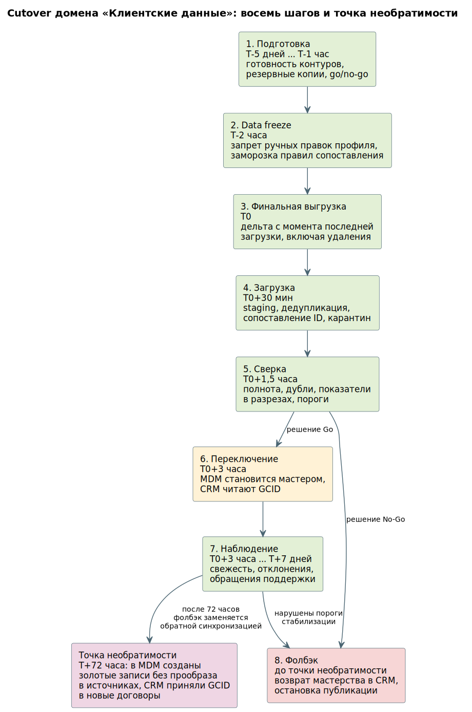

# cutover-plan.md — план переключения ключевого перехода

> Назначение документа: описать конкретное включение изменения в рабочем контуре: цель переключения, условия запуска, роли, пошаговый сценарий, состояние данных, наблюдаемость, сравнение нового поведения со старым и rollback-сценарий.

## 0. Паспорт cutover-плана

| Поле | Значение |
|---|---|
| Название перехода | Передача мастерства клиентского профиля в MDM Customer Hub |
| Связанный этап roadmap | Этап 1 «Подготовка мастер-данных», завершающее переключение |
| Связанная точка трансформации | D-01 разные идентификаторы клиента, D-07 отзыв согласия не доходит до потребителей |
| Тип переключения | Данные и мастерство: меняется источник истины для идентифицирующих атрибутов клиента |
| Временное окно | Суббота, начало в 22:00, окно 6 часов, период наблюдения 7 дней |
| Среда | Production |
| Зона воздействия | Клиентские записи обоих банков; пользователи — менеджеры FU CRM и RB CRM, операторы контактных центров, системы-потребители GCID |
| Ответственный за go / no-go | Владелец программы объединения данных, при участии владельцев клиентских данных розницы и МСБ |
| Автор документа | Архитектор данных программы объединения |
| Версия | 1.0 |

## 1. Цель переключения

Цель переключения — перевести сценарий ведения клиентского профиля для всех клиентов обоих банков с текущего поведения, при котором FU CRM и RB CRM независимо создают и изменяют клиентские записи с локальными идентификаторами, на новый контур, где MDM Customer Hub является мастером идентифицирующих атрибутов и присваивает корпоративный идентификатор GCID, а обе CRM остаются мастерами контактных данных своих клиентов.

После переключения система должна создавать новые клиентские записи только через MDM, изменять идентифицирующие атрибуты только в MDM, а контактные атрибуты — в CRM с публикацией изменения в шину. Данные должны быть сопоставлены: каждая клиентская запись имеет GCID либо находится в карантине с зафиксированной причиной. Метрики задержки распространения GCID, доли записей в карантине и доли записей без GCID должны оставаться в пределах порогов раздела 2.3.

Старый контур сохраняется как источник сверки и fallback до завершения периода наблюдения. После точки необратимости, описанной в разделе 10, простой возврат маршрута перестаёт работать и заменяется обратной синхронизацией.

## 2. Объём переключения

### 2.1. Включаем

- Идентифицирующие атрибуты клиента: тип стороны, ФИО или наименование, дата рождения или регистрации, ИНН, паспортные реквизиты, ОГРН.
- Присвоение и распространение корпоративного идентификатора GCID во все системы-потребители.
- Реестр соответствия локальных идентификаторов двух банков корпоративному.
- Справочник клиентских сегментов и его применение к клиенту.
- Публикацию событий изменения золотой записи в шину.

### 2.2. Не включаем

- Контактные атрибуты: телефон, электронная почта, адрес фактического проживания. Остаются в мастерстве CRM соответствующего банка. Переход на единое мастерство контактов — отдельное переключение после объединения CRM.
- Согласия. Остаются в мастерстве CRM, выдавшей согласие, до запуска выделенного контура согласий. В этом окне меняется только способ распространения отзыва — через шину, а не мастерство.
- Договоры, счета, карты, кредитные сделки, платежи и операции. Мастерство остаётся в профильных системах.
- Обращения клиентов. Классификаторы двух CRM не объединены, переключение выполняется на этапе 6.
- Клиентов, находящихся в карантине сопоставления. Они обслуживаются по локальным идентификаторам до разбора стюардом.
- Партнёрские интеграции RetailBank, использующие локальные идентификаторы. Переводятся отдельно после инвентаризации.

### 2.3. Критерии успешного переключения

| Критерий | Целевое значение | Где проверяем | Кто подтверждает |
|---|---|---|---|
| Доля клиентских записей с присвоенным GCID | Не ниже согласованного владельцами порога по каждому банку отдельно | Витрина качества MDM | Стюард клиентских данных |
| Доля записей в карантине сопоставления | Не выше согласованного порога, все записи имеют зафиксированную причину | Витрина качества, реестр карантина | Стюард клиентских данных |
| Задержка распространения GCID до систем-потребителей | Не более 5 минут по 95-му процентилю | Дашборд интеграционного слоя | SRE |
| Консистентность GCID во всех потребителях | Полное совпадение: одна клиентская запись — один GCID во всех системах | Сверка реестра соответствия с базами потребителей | Data Engineer |
| Расхождение количества активных клиентов между legacy и MDM | Объяснено полностью: разница равна числу выявленных дублей плюс карантин | Контур сверки | Владелец клиентских данных |
| Доступность сценария работы с клиентом в обеих CRM | Ошибки открытия карточки клиента не выше базового уровня | Дашборд приложений, обращения поддержки | Поддержка |
| Корректность распространения отзыва согласия | Отзыв доходит до всех систем-потребителей не более чем за 15 минут | Журнал контура согласий | Служба комплаенс |

## 3. Условия запуска: go / no-go

| Условие | Тип | Как проверяем | Порог / ожидаемое состояние | Статус | Ответственный |
|---|---|---|---|---|---|
| Историческая загрузка клиентских записей в MDM завершена | Данные | Сравнение числа загруженных записей с числом записей в источниках по каждому банку | Расхождение объяснено полностью | go / no-go | Data Engineer |
| Регулярная дельта из обеих CRM работает без разрывов | Данные | Непрерывность журнала загрузок за последние 7 суток | Разрывов нет | go / no-go | Data Engineer |
| Правила сопоставления утверждены владельцами | Операционное | Подписанный протокол утверждения правил и порогов | Утверждены до окна | go / no-go | Владелец клиентских данных |
| Карантин разобран до согласованного уровня | Данные | Витрина качества: доля и возраст записей в карантине | В пределах порога | go / no-go | Стюард клиентских данных |
| Резервные копии баз обеих CRM и MDM созданы и проверены восстановлением | Техническое | Отчёт о резервном копировании и результат тестового восстановления | Восстановление успешно | go / no-go | DBA |
| Системы-потребители готовы принимать GCID | Техническое | Проверка на тестовом контуре: приём и сохранение GCID каждым потребителем | Все подтвердили | go / no-go | Команда интеграции |
| Реестр потребителей клиентских данных полон | Операционное | Анализ журналов подключений к обеим CRM за 30 суток | Новых потребителей не выявлено за последние 7 суток | go / no-go | Data Office |
| Мониторинг и оповещения настроены | Наблюдаемость | Проверка дашбордов и срабатывания тестового алерта | Алерты доходят до дежурного | go / no-go | SRE |
| Инструкции поддержки готовы и доведены | Коммуникация | Подтверждение прохождения инструктажа обеими линиями поддержки | Подтверждено руководителями | go / no-go | Поддержка |
| Ответственный за решение Go доступен в окне | Операционное | Подтверждение присутствия и права принятия решения | Подтверждено письменно | go / no-go | Владелец программы |
| Пользователи предупреждены о недоступности изменения профиля | Коммуникация | Рассылка за 3 рабочих дня и напоминание за сутки | Отправлена | go / no-go | Поддержка |

Если хотя бы одно условие типа «Данные» или «Операционное» не выполнено, решение — no-go. Отдельно: если во время окна выяснится, что право подтвердить показатель есть только у отсутствующего руководителя, технически готовая миграция остановится по организационной причине — поэтому доступность принимающего решение вынесена в отдельное условие.

## 4. Роли и ответственность

| Роль | Ответственность до переключения | Ответственность во время переключения | Ответственность после переключения | Контакт / канал |
|---|---|---|---|---|
| Руководитель переключения | Сбор подтверждений go/no-go, согласование окна | Решение go/no-go, координация шагов, решение о фолбэке | Итоговое решение о признании cutover успешным | Оперативный канал переключения |
| Архитектор данных | Проверка матрицы владения и правил маршрутизации изменений | Контроль того, что мастерство передаётся по объявленным границам | Анализ результата, закрытие или продление временных компонентов | Оперативный канал |
| Команда интеграции | Подготовка релиза шины, реестра схем, маршрутизации | Переключение маршрутов, включение публикации GCID | Исправление дефектов интеграции | Оперативный канал |
| Data Engineer | Проверка полноты исторической загрузки и непрерывности дельты | Финальная выгрузка, загрузка в staging, прогон технических проверок | Сверка данных, повторные загрузки при необходимости | Оперативный канал |
| DBA | Резервные копии и тестовое восстановление | Контроль состояния баз, снятие точек восстановления | Освобождение ресурсов, контроль роста объёма | Оперативный канал |
| Стюард клиентских данных | Разбор карантина до порога | Оценка новых попаданий в карантин во время загрузки | Ежедневный разбор карантина в период наблюдения | Рабочий канал Data Office |
| SRE | Настройка дашбордов и алертов | Наблюдаемость, реакция на инциденты | Дежурство в период стабилизации | Дежурный канал |
| Поддержка | Инструкции и инструктаж обеих линий | Обработка обращений, эскалация по согласованному маршруту | Сбор обратной связи, статистика обращений, связанных с переходом | Канал поддержки |
| Владелец клиентских данных | Утверждение правил сопоставления и порогов | Решение о допустимости обнаруженных расхождений | Оценка эффекта, приёмка результата | Канал владельцев данных |
| Служба комплаенс | Проверка готовности распространения отзывов согласий | Контроль корректности обработки согласий при переносе | Подтверждение правового режима обработки | Канал комплаенс |

## 5. Состояние данных до переключения

| Данные / сущность | Источник истины до переключения | Источник истины после переключения | Подготовка до cutover | Проверка консистентности | Что делаем при расхождении |
|---|---|---|---|---|---|
| Идентифицирующие атрибуты клиента (E-01) | FU CRM и RB CRM независимо | MDM Customer Hub | Историческая загрузка обеих баз, сопоставление, разбор карантина | Сравнение числа записей по каждому банку, выборочная сверка атрибутов по случайной выборке | Расхождение выше порога — no-go; единичные — изолировать и продолжить |
| Корпоративный идентификатор GCID | Не существует | MDM Customer Hub, реестр соответствия | Присвоение GCID всем сопоставленным записям | Каждая запись имеет ровно один GCID; один GCID не связан с двумя записями одного источника | Множественный GCID на запись — no-go: это ошибка сопоставления, а не загрузки |
| Контактные атрибуты клиента | FU CRM и RB CRM | Остаются в CRM своего банка | Не изменяются | Отсутствие попыток записи контактов со стороны MDM | Обнаружена запись контактов из MDM — остановить публикацию, границы мастерства нарушены |
| Согласия (E-13) | FU CRM и RB CRM | Остаются в CRM, меняется только способ распространения отзыва | Проверка полноты признака согласия по активным клиентам | Отзыв, выполненный в тестовом сценарии, доходит до всех потребителей | Отзыв не дошёл — no-go: это прямой регуляторный риск |
| Клиентский сегмент (E-15) | FU CRM и RB CRM по разным правилам | MDM как справочник, расчёт отнесения в DWH | Загрузка справочника сегментов, фиксация правил обоих банков | Каждый клиент отнесён к одному действующему сегменту | Клиент в двух сегментах одновременно — изолировать, сегмент не проставлять |
| Локальные идентификаторы | CRM и АБС каждого банка | Сохраняются как атрибуты, мастерство не меняется | Загрузка в реестр соответствия | Обратимость: по GCID восстанавливается локальный идентификатор каждого источника | Невосстановимая связь — no-go: трассировка до источника потеряна |

## 6. Наблюдаемость и контроль перед стартом

| Что наблюдаем | Метрика / сигнал | Норма | Где смотрим | Алерт | Ответственный |
|---|---|---|---|---|---|
| Поток клиентских изменений из CRM в шину | Сквозная задержка | Не более 5 минут по 95-му процентилю | Дашборд интеграционного слоя | Превышение 10 минут в течение 5 минут подряд | SRE |
| Обработка в MDM | Отставание потребителя | Не более согласованного числа сообщений | Дашборд брокера и MDM | Отставание выше порога | SRE |
| Отбраковка на шине | Размер очереди недоставленных сообщений | Ноль новых за час до окна | Дашборд шины | Любое новое сообщение в очереди | Data Engineer |
| Качество сопоставления | Доля записей в карантине | В пределах порога, не растёт | Витрина качества | Рост доли карантина более чем на согласованную величину за час | Стюард клиентских данных |
| Доступность CRM | Ошибки открытия карточки клиента | Базовый уровень | Дашборд приложений | Превышение базового уровня вдвое | SRE |
| Обращения поддержки | Число обращений, связанных с клиентским профилем | Базовый уровень | Система поддержки | Рост вдвое к базовому | Поддержка |

## 7. Пошаговый сценарий переключения

| Шаг | Время / окно | Действие | Ответственный | Проверка результата | Решение при ошибке |
|---|---|---|---|---|---|
| 1 | T−5 дней | Финальная проверка готовности: полнота исторической загрузки, непрерывность дельты, разбор карантина до порога | Data Engineer, стюард | Отчёт готовности подписан | Перенести окно |
| 2 | T−3 дня | Рассылка пользователям и инструктаж обеих линий поддержки | Поддержка | Подтверждение прохождения инструктажа | Перенести окно |
| 3 | T−1 день | Резервные копии баз обеих CRM и MDM, тестовое восстановление | DBA | Восстановление успешно завершено | Перенести окно |
| 4 | T−1 час | Сбор решения go/no-go по таблице раздела 3 | Руководитель переключения | Все критичные условия в статусе go | No-go: окно закрывается, причины фиксируются |
| 5 | T−2 часа | Data freeze: запрет ручных правок клиентского профиля, заморозка правил сопоставления и таблиц соответствия | Архитектор данных, поддержка | Попытка ручной правки отклоняется, изменения правил заблокированы | Отложить старт до подтверждения заморозки |
| 6 | T0 | Финальная выгрузка дельты из обеих CRM с момента последней регулярной загрузки, включая удаления и логические деактивации | Data Engineer | Выгрузка имеет идентификатор, временной диапазон и контрольные показатели | Повторить выгрузку; при повторной ошибке — no-go |
| 7 | T0+30 мин | Загрузка финальной дельты в staging: проверка схемы, дедупликация, сопоставление идентификаторов | Data Engineer | Все записи обработаны, ошибочные в карантине с причиной | Разобрать причину; при массовой отбраковке — no-go |
| 8 | T0+1 час | Перенос обработанной дельты в целевой слой MDM | Data Engineer | Число записей в MDM соответствует ожидаемому | Откат загрузки, возврат к шагу 7 |
| 9 | T0+1,5 часа | Сверка по разделу 8.2: полнота, дубли, показатели в разрезах | Data Engineer, стюард | Все проверки в пределах порогов | Отклонение выше порога — решение No-Go и фолбэк |
| 10 | T0+2,5 часа | Решение Go/No-Go по результатам сверки | Руководитель переключения, владелец данных | Решение зафиксировано письменно | No-Go: переход к разделу 10 |
| 11 | T0+3 часа | Переключение: MDM объявляется мастером идентифицирующих атрибутов, включается публикация GCID, маршруты изменения профиля направляются в MDM | Команда интеграции | Изменение идентифицирующего атрибута в CRM отклоняется с понятным сообщением | Вернуть маршрутизацию, перейти к разделу 10 |
| 12 | T0+3,5 часа | Снятие data freeze, возобновление обычной работы | Архитектор данных | Правки контактных данных проходят, правки идентифицирующих идут через MDM | Продлить freeze до устранения |
| 13 | T0+4 часа | Проверка бизнес-сценария: открытие карточки клиента, поиск, создание нового клиента, отзыв согласия | Поддержка, владелец данных | Все сценарии проходят, GCID виден в карточке | Дефект в критичном сценарии — фолбэк |
| 14 | T0+5 часов | Решение о завершении окна: продолжить наблюдение, ограничить или откатить | Руководитель переключения | Решение зафиксировано | Откат по разделу 10 |

В одном окне сознательно не совмещаются несколько независимых изменений: не меняются формулы сегментации, структура витрин и интерфейс CRM. Если поменять источник, правило и интерфейс одновременно, причину ошибки установить будет нельзя.

## 8. Проверки после переключения

### 8.1. Технические проверки

| Проверка | Ожидаемое значение | Источник | Что делать при нарушении |
|---|---|---|---|
| Доступность MDM для чтения и записи | Отклик в пределах норматива, ошибок нет | Дашборд MDM | Ограничить трафик записи, разобрать причину |
| Ошибки интеграции CRM с шиной | Не выше базового уровня | Дашборд интеграционного слоя | Приостановить публикацию GCID, разобрать |
| Задержка распространения GCID | Не более 5 минут по 95-му процентилю | Дашборд шины | Проверить отставание потребителя, масштабировать обработчик |
| Размер очереди недоставленных сообщений | Не растёт | Дашборд шины | Разобрать ядовитые сообщения, проверить версию схемы |
| Ошибки открытия карточки клиента в обеих CRM | Не выше базового уровня | Дашборд приложений | При превышении вдвое — фолбэк |

### 8.2. Проверки данных

| Проверка | Ожидаемое значение | Метод сверки | Что делать при расхождении |
|---|---|---|---|
| Количество активных клиентских записей | Разница с суммой двух источников объясняется числом выявленных дублей плюс карантин | Сравнение по каждому банку отдельно и в сумме | Необъяснённая разница — фолбэк |
| Пропущенные источники в загрузке | Ноль | Контроль состава загрузки по идентификатору выгрузки | Остановить переключение |
| Необъяснённые дубли по GCID | Ноль: один GCID не связан с двумя записями одного источника | Проверка уникальности в реестре соответствия | Изолировать записи, продолжить анализ, при массовости — фолбэк |
| Полнота идентифицирующих атрибутов | Не ниже порога, согласованного владельцем | Витрина качества | Ниже порога — решение владельца Go/No-Go |
| Обратимость связи GCID и локальных идентификаторов | Полная: по GCID восстанавливается локальный идентификатор каждого источника | Выборочная проверка по случайной выборке | Фолбэк: трассировка до источника потеряна |
| Распределение по сегментам | Отсутствуют клиенты в двух действующих сегментах одновременно | Запрос к MDM | Изолировать, сегмент не проставлять |

Сравнение количества строк само по себе недостаточно: если в источниках были дубли, очищенный набор закономерно окажется меньше. Поэтому ожидаемое значение сформулировано через объяснимость разницы, а не через её отсутствие.

### 8.3. Проверки поведения нового контура относительно старого

| Сценарий | Ожидаемое поведение нового контура | Как сравниваем со старым | Допустимое расхождение | Решение при отклонении |
|---|---|---|---|---|
| Поиск клиента по паспортным данным | Находит единую запись обоих банков с портфелем продуктов | Ручная сверка на контрольной выборке клиентов, известных как пересекающиеся | Ноль ненайденных из контрольной выборки | Приостановить публикацию GCID, разобрать правила сопоставления |
| Создание нового клиента | Запись создаётся в MDM, GCID присваивается, обе CRM получают её | Сравнение со сценарием создания в старом контуре по времени и результату | Время создания не более чем вдвое дольше прежнего | Ограничить сценарий частью пользователей, разобрать |
| Изменение идентифицирующего атрибута | Изменение возможно только через MDM, распространяется во все потребители | Параллельная проверка: изменение в CRM отклоняется | Ноль случаев успешной прямой правки в CRM | Границы мастерства нарушены — остановить, проверить маршрутизацию |
| Отзыв согласия | Доходит до всех систем-потребителей | Контрольный отзыв на тестовом клиенте с проверкой каждого потребителя | Не более 15 минут, ноль непроинформированных потребителей | Фолбэк: регуляторный риск не допускает компромисса |
| Расчёт числа клиентов для управленческой отчётности | Совпадает с объяснённой разницей относительно суммы двух источников | Параллельный прогон отчёта на старом и новом контуре | В пределах согласованного порога | Отклонение выше порога — разбор причины до расширения сценария |

### 8.4. Операционные проверки

| Проверка | Кто проверяет | Ожидаемое состояние | Что делать при проблеме |
|---|---|---|---|
| Поддержка видит GCID и понимает его назначение | Руководитель линии поддержки | GCID отображается в карточке, инструкция применима | Дообучение, при массовом непонимании — приостановить расширение |
| Инструкция по спорным сопоставлениям применима | Стюард клиентских данных | Оператор знает маршрут эскалации спорной записи | Доработать инструкцию в течение суток |
| Клиент, попавший в карантин, обслуживается | Поддержка | Обслуживание идёт по локальному идентификатору без отказа | Обнаружен отказ в обслуживании — немедленная эскалация |
| Сообщения об ошибках понятны пользователю | Поддержка | Отклонение правки в CRM объясняет, что делать | Исправить текст сообщения, инструктаж |

## 9. Критерии стабилизации после переключения

| Период наблюдения | Что должно быть стабильно | Порог | Решение |
|---|---|---|---|
| Первые 15 минут | Доступность MDM и обеих CRM, отсутствие всплеска ошибок интеграции | Ошибки не выше базового уровня | Продолжить или откатить |
| Первый час | Задержка распространения GCID, размер очереди недоставленных сообщений, отсутствие роста карантина | Задержка не более 5 минут, очередь не растёт | Продолжить, ограничить публикацию или откатить |
| Первый день | Обращения поддержки по клиентскому профилю, доля записей без GCID, корректность создания новых клиентов | Обращения не выше двукратного базового уровня | Продолжить наблюдение или откатить |
| Первая неделя | Ежедневный разбор карантина идёт в срок, расхождение с legacy объяснимо, отзывы согласий доходят | Карантин не накапливается, возраст записи не более 2 рабочих дней | Признать cutover успешным или пересмотреть roadmap |

Открытие первой карточки клиента с GCID не означает завершения перехода. Период стабилизации завершается, когда новый контур выполняет SLA, критичных расхождений нет, а потребители действительно работают с новым источником.

## 10. Rollback-сценарий

### 10.1. Условия запуска rollback

| Триггер rollback | Порог | Кто принимает решение | Максимальное время реакции |
|---|---|---|---|
| Необъяснённое расхождение числа клиентских записей | Разница не сводится к дублям и карантину | Владелец клиентских данных | 30 минут |
| Множественный GCID на одну запись источника | Любой подтверждённый случай массового характера | Архитектор данных | 15 минут |
| Отзыв согласия не доходит до потребителей | Любой подтверждённый случай | Служба комплаенс | Немедленно |
| Недоступность сценария работы с клиентом в CRM | Ошибки выше двукратного базового уровня в течение 15 минут | Руководитель переключения | 15 минут |
| Потеря обратимости связи GCID и локальных идентификаторов | Любой подтверждённый случай | Архитектор данных | 15 минут |
| Рост карантина, блокирующий обслуживание | Доля клиентов без возможности идентификации выше согласованной | Владелец клиентских данных | 1 час |

### 10.2. Шаги rollback

| Шаг | Действие | Ответственный | Проверка результата | Что делать с данными, созданными в новом контуре |
|---|---|---|---|---|
| 1 | Остановить публикацию GCID в системы-потребители | Команда интеграции | Новые сообщения с GCID не публикуются | Уже доставленные GCID остаются как атрибут, но не используются для идентификации |
| 2 | Вернуть маршрут изменения идентифицирующих атрибутов в CRM | Команда интеграции | Правка профиля в CRM проходит | Изменения, сделанные в MDM после переключения, выгружаются в реестр спорных записей |
| 3 | Поставить на паузу обработку очереди клиентских событий | SRE | Обработка остановлена, сообщения сохранены | Сообщения не удаляются: после разбора применяются повторно по стабильному ключу |
| 4 | Сверить и зафиксировать записи, созданные или изменённые в MDM в окне переключения | Data Engineer, стюард | Реестр спорных записей сформирован | Каждая запись получает решение: применить в CRM вручную, оставить в карантине или отменить |
| 5 | Восстановить состояние MDM из резервной копии, если реестр спорных записей превышает согласованный объём | DBA | Восстановление успешно, контрольные показатели совпадают | Записи из реестра применяются после восстановления |
| 6 | Сообщить поддержке, владельцам данных и бизнесу | Руководитель переключения | Подтверждение получения всеми адресатами | — |

### 10.3. Состояние после rollback

| Область | Ожидаемое состояние после отката | Как проверяем |
|---|---|---|
| Маршруты | Изменение клиентского профиля снова идёт в CRM обоих банков | Тестовая правка проходит в каждой CRM |
| Данные | Потерь нет; записи, изменённые в окне, зафиксированы в реестре спорных и имеют решение | Сверка числа записей с состоянием до окна плюс реестр спорных |
| Очереди и события | Нет неконтролируемой повторной обработки: повторное применение идёт по стабильному ключу | Проверка отсутствия дублей после возобновления обработки |
| Пользовательские статусы | Клиент не видит изменений; менеджер работает в прежнем режиме | Проверка карточки клиента в обеих CRM |
| Поддержка | Имеет инструкцию, как отвечать на вопрос о временно появлявшемся едином профиле | Подтверждение руководителя линии поддержки |

### 10.4. Точка необратимости

Простой возврат маршрута работает только пока новый контур не начал создавать уникальные данные и не стал фактическим мастером. Точка необратимости наступает через 72 часа после переключения, когда одновременно выполнены два условия: в MDM созданы золотые записи новых клиентов, не имеющие прообраза ни в одной CRM, и системы-потребители проставили GCID в договоры, заключённые после переключения.

После этой точки фолбэк заменяется отдельным планом восстановления: обратная синхронизация золотых записей в CRM, ручное разведение записей, созданных в новом контуре, и повторное присвоение локальных идентификаторов. Стоимость такого возврата на порядок выше, поэтому решение о продолжении или откате принимается до истечения 72 часов, а не откладывается «до накопления статистики».

## 11. Коммуникационный план

| Аудитория | Когда сообщаем | Что сообщаем | Канал | Ответственный |
|---|---|---|---|---|
| Команда разработки и интеграции | За 5 дней, в окне, после | План, роли, шаги; статус каждого шага; итог | Оперативный канал переключения | Руководитель переключения |
| Эксплуатация и SRE | За 5 дней, в окне, после | Пороги алертов, порядок дежурства; статус метрик; итог и режим дежурства на неделю | Дежурный канал | SRE |
| Поддержка обеих линий | За 3 дня, в окне, после | Инструкции, маршрут эскалации; момент снятия freeze; статистика обращений | Канал поддержки | Поддержка |
| Владельцы клиентских данных | За 5 дней, в окне на шаге решения, после | Критерии приёмки; результаты сверки для решения Go; итог и остаточные расхождения | Канал владельцев данных | Владелец программы |
| Служба комплаенс | За 5 дней, в окне после проверки согласий, после | Порядок обработки согласий; результат контрольного отзыва; подтверждение режима | Канал комплаенс | Служба комплаенс |
| Менеджеры и операторы | За 3 дня, за сутки, после снятия freeze | Период недоступности изменения профиля; напоминание; возобновление работы и что нового в карточке | Внутренняя рассылка | Поддержка |
| Клиенты | Не сообщаем | Изменение внутреннее, клиентские сценарии не затрагиваются | — | — |

## 12. Итоговое решение после окна переключения

| Вопрос | Ответ |
|---|---|
| Переключение признано успешным? | Заполняется по итогам периода стабилизации |
| Какие критерии выполнены? | Перечень из раздела 2.3 с фактическими значениями |
| Какие отклонения обнаружены? | Реестр отклонений с решением по каждому |
| Какие действия нужны после cutover? | Разбор остатка карантина, закрытие или продление временных компонентов, подготовка следующего переключения |
| Можно ли переходить к следующему этапу roadmap? | Да при выполнении критериев стабилизации первой недели; при частичном выполнении — с фиксацией условий |

## 13. Проверка качества cutover-плана

- [x] указано, что именно переключается и в каком объёме: идентифицирующие атрибуты и GCID включены, контакты, согласия и учётные сущности исключены;
- [x] есть go / no-go условия с типами, порогами и ответственными, включая доступность принимающего решение;
- [x] роли привязаны к конкретным действиям на каждом этапе, а не описаны общими словами;
- [x] сценарий переключения пошаговый, с временными метками и решением при ошибке на каждом шаге;
- [x] состояние данных описано отдельно до, во время и после переключения, с источником истины по каждой сущности;
- [x] есть наблюдаемость: метрики, нормы, дашборды, условия алертов и владельцы;
- [x] новый контур сравнивается со старым через пять конкретных сценариев с порогами и методом сверки;
- [x] rollback включает маршрутизацию, данные, очереди, статусы, коммуникацию и отдельно описанную точку необратимости;
- [x] есть критерии стабилизации по четырём периодам наблюдения;
- [x] по итогам cutover принимается решение о продолжении roadmap.
