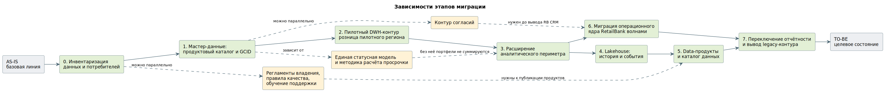

# migration-plan.md — roadmap инкрементальной миграции

> Назначение документа: показать безопасный путь от AS-IS к TO-BE через промежуточные состояния, зависимости, риски, условия остановки и критерии завершения этапов.

## 0. Паспорт roadmap

| Поле | Значение |
|---|---|
| Название проекта | Объединение данных FinUnion Group и RetailBank |
| Связанный документ трансформации | `migration-target-state.md`, Task 3 `target-data-architecture.md` |
| Горизонт планирования | 12 месяцев, с контрольной точкой промежуточного состояния на 3 месяце |
| Выбранная стратегия миграции | Incremental Migration волнами, с Parallel Run на переходе аналитического контура. Big Bang исключён ограничением кейса о невозможности одновременной замены систем RetailBank |
| Ключевые паттерны | Strangler Fig для вытеснения legacy-систем, Anti-Corruption Layer на шине для приведения моделей двух банков, Event-Driven и CDC для доставки изменений, Messaging Bridge между событийными контурами двух банков |
| Автор | Архитектор данных программы объединения |
| Дата | Старт программы |
| Версия | 1.0 |

## 1. Краткое резюме roadmap

Миграция выполняется инкрементально, потому что операционные системы двух банков обслуживают клиентов непрерывно, а замена всех систем RetailBank за один шаг прямо исключена ограничениями кейса. Сначала команда инвентаризирует данные, потоки и скрытых потребителей и фиксирует базовую линию показателей. Затем присваивает клиентам корпоративный идентификатор и сводит справочники, потому что без единого ключа объединять портфели бессмысленно: результат не с чем связать. После этого запускается пилотный аналитический контур на ограниченном, но репрезентативном срезе, расширяется на весь аналитический периметр, и только потом начинается миграция операционного ядра RetailBank волнами.

Такой порядок выбран из-за трёх зависимостей: единый клиентский идентификатор нужен раньше объединения любых портфелей; единая статусная модель и методика расчёта просрочки нужны раньше сведения отчётности, иначе портфели не суммируются; реестр потребителей старого контура нужен раньше его отключения, потому что опрос владельцев отчётности даёт неполный результат.

Основные риски roadmap связаны с ошибками сопоставления клиентов и продуктов, с расхождением бизнес-правил двух банков и с неучтёнными потребителями legacy-систем, поэтому для каждого этапа заданы критерии готовности и условия остановки.

## 2. Стартовое и целевое состояние

| Состояние | Описание | Ключевые ограничения | Метрики / признаки состояния |
|---|---|---|---|
| AS-IS | Два независимых ландшафта. Клиентские данные дублируются между FU CRM и RB CRM без сквозного ключа. Отчётность считается отдельно, метрики не совпадают. У RetailBank нет Data Lake и централизованного управления потоками, интеграции точечные. Data Lake FinUnion частичный, без каталога, lineage и правил качества | Нельзя останавливать обслуживание клиентов; нельзя заменить все системы RetailBank за один шаг; аналитика не должна нагружать операционные системы, хотя сегодня это правило нарушается batch-выгрузками напрямую из АБС | Число клиентских записей в каждой CRM; доля пересечения клиентских баз неизвестна; расхождение кредитного портфеля между FU DWH и RB DWH; время формирования регуляторной отчётности; число точечных интеграций RetailBank |
| Промежуточное состояние 1 (после этапа 1, 2 месяца) | Клиенты обоих банков имеют корпоративный идентификатор, продуктовые линейки сопоставлены, справочники ведутся в MDM. Обе CRM обогащаются GCID через шину | Портфели ещё не объединены, отчётность по-прежнему считается в двух DWH, операционные системы не тронуты | Доля клиентских записей с GCID; число неразрешённых пар в карантине; доля сопоставленных продуктов |
| Промежуточное состояние 2 (после этапа 3, 3 месяца) | Работает единая управленческая отчётность по клиентам, счетам, продуктам и операциям на целевом DWH. Данные обоих банков сведены в согласованный слой | История операций и события каналов не перенесены; legacy-контур продолжает работать; регуляторная отчётность формируется по-старому | Расхождение витрин целевого DWH и двух legacy DWH в разрезах; готовность витрин до 07:00; доля запусков в SLA |
| Промежуточное состояние 3 (после этапа 5, 8 месяцев) | Работает Lakehouse с историей и событиями, опубликованы пять data-продуктов с владельцами и контрактами, каталог данных заполнен | Операционное ядро RetailBank не мигрировано, legacy-системы обслуживают действующие портфели | Состояние данных воспроизводится на выбранную дату; доля сущностей с назначенным владельцем; число продуктов с автоматически проверяемым контрактом |
| TO-BE (12 месяцев) | Единый операционный контур на системах FinUnion, MDM как мастер клиентских и справочных данных, DWH для регламентированной отчётности, Lakehouse для истории и событий, каталог с lineage. Legacy-контур RetailBank выведен | Полноценный Data Mesh не внедрён: доменные команды не сформированы, взяты продуктовое мышление и федеративное управление | Legacy-контур не получает запросов контрольный период; сверка в пределах порогов три отчётных периода подряд; все потребители зарегистрированы в каталоге |

## 3. Принципы построения roadmap

- **Сначала измеряем, потом меняем.** До первой волны собираются: количество клиентских записей в каждой системе, оценка доли пересечения баз, текущее расхождение кредитного портфеля между двумя DWH, время формирования отчётности, реестр потребителей каждой legacy-системы по журналам SQL-запросов, BI-моделям, подключениям и заданиям планировщиков. Без базовой линии невозможно доказать, что стало лучше, и невозможно объяснить расхождение после переключения.
- **Сначала изолируем риск, потом расширяем сценарий.** Ослабляется зависимость от прямого доступа к базам: batch-выгрузки из АБС и точечные интеграции RetailBank оборачиваются шиной и CDC до того, как на этих потоках начнёт строиться отчётность.
- **Сначала управляемый пилот, потом масштабирование.** Границы пилота — розничные клиенты одного региона присутствия обоих банков, включая пересекающихся клиентов, несколько продуктов, мультивалютные операции и возвраты. Пилот ограничен по объёму, но не искусственно прост: регион без пересечений и без проблемных справочников проверил бы только инфраструктуру, а основные ошибки обнаружились бы при масштабировании.
- **Сначала модель состояний, потом коммуникация.** До переноса портфелей согласуются единая статусная модель договоров и счетов, словарь соответствия статусов карт и единая методика расчёта просрочки. Одинаково названные статусы двух банков означают разные этапы процесса.
- **Сначала реестр потребителей данных, потом декомпозиция.** Ни одна legacy-система не отключается до тех пор, пока не выявлены все её потребители, включая локальные скрипты, выгрузки партнёрам и финансовые сверки.

## 4. Roadmap миграции

| Этап | Цель | Промежуточное состояние | Основные работы | Зависимости | Риски | Критерии завершения |
|---|---|---|---|---|---|---|
| AS-IS | Зафиксировать стартовую точку | Два независимых ландшафта, базовая линия не измерена | Профилирование источников, замер текущих показателей и SLA | — | Неизвестен объём данных и доля пересечения клиентских баз; неизвестны скрытые потребители | Базовая линия подтверждена владельцами |
| 0. Инвентаризация данных и потребителей | Получить реестр данных, потоков, владельцев и потребителей | Известно, что где лежит, кто владеет и кто читает | Инвентаризация систем, таблиц и потоков; анализ журналов SQL-запросов и подключений к обоим DWH; назначение владельцев и стюардов; профилирование объёмов | AS-IS | Опрос владельцев отчётности даёт неполный результат; часть потребителей выявляется только по логам | Реестр данных и зависимостей сформирован, у каждой критичной сущности есть владелец, объёмы профилированы |
| 1. Подготовка мастер-данных | Присвоить корпоративный идентификатор и свести справочники | Клиенты имеют GCID, продуктовые линейки сопоставлены | Развёртывание MDM; правила сопоставления клиентов с порогом уверенности; реестр соответствия ID; сведение справочников продуктов, тарифов, отделений, сегментов; обогащение обеих CRM через шину | Этап 0 | Ошибки сопоставления дают ложные слияния; сопоставление продуктов по названию вместо экономического содержания | Критичные записи имеют корпоративный идентификатор, неоднозначные пары изолированы, владельцы подтвердили правила сопоставления |
| 2. Пилотный DWH-контур | Проверить полный путь данных на ограниченном срезе | Работает витрина розничного портфеля пилотного региона на целевом DWH | Развёртывание PostgreSQL DWH и Airflow; загрузка staging → core → витрина; параллельный прогон со старыми отчётами; автоматическая сверка в разрезах | Этап 1, единая статусная модель | Расхождение со старым контуром из-за разных бизнес-правил, а не из-за ошибки миграции | Новый и старый отчёты проходят согласованную сверку, отклонения зарегистрированы и разобраны, владелец подтвердил формулы |
| 3. Расширение аналитического периметра | Свести управленческую отчётность двух банков | Единая управленческая отчётность по клиентам, счетам, продуктам, операциям | Подключение счетов, платежей, операций и кредитов обоих банков; перевод выгрузок с batch на CDC; расчёт витрин; сверка портфелей | Этап 2, единая методика расчёта просрочки | Портфели не суммируются из-за разных определений дефолта; нагрузка выгрузок на операционные системы | Доступна единая управленческая аналитика, расхождение с legacy в пределах порога в разрезах по продукту, региону и периоду |
| 4. Подключение Lakehouse | Перенести историю и событийные данные | Состояние данных воспроизводится на выбранную дату | Развёртывание объектного хранилища, Iceberg, Trino; перенос истории карточных операций порциями; подключение событий каналов через Kafka; псевдонимизация на переходе bronze → silver | Этап 3 | Неуправляемое озеро при отсутствии правил публикации; деградация чтения из-за мелких файлов | История перенесена и сверена, снапшот фиксируется для повторной проверки, правила публикации по каждому слою действуют |
| 5. Публикация data-продуктов и каталога | Закрепить владение и контракты | Пять продуктов опубликованы с владельцами, контрактами и SLA | Развёртывание DataHub; наполнение каталога и lineage; оформление паспортов продуктов; автоматическая проверка контрактов в конвейере сборки | Этап 4, регламенты владения | Перенос таблицы в доменную схему без владельца и контракта не создаёт продукт | Определены контракты, SLA, правила качества и потребители; продукт без подтверждённого потребителя не публикуется |
| 6. Миграция операционного ядра RetailBank | Перевести портфели на системы FinUnion | Действующие клиенты и портфели обслуживаются целевыми системами | Волны по продуктовым сегментам: договоры и счета, карты, кредиты, обращения; параллельный прогон и сверка; переключение мастерства по группам записей | Этап 3, контур согласий, единый классификатор обращений | Потеря корректного изменения при параллельной работе двух мастеров; незакрытые операции на момент переключения | Портфели перенесены и сверены, мастерство передано, legacy переведён в режим только для чтения |
| 7. Переключение отчётности и вывод legacy-контура | Завершить переход | Единый контур, legacy выведен | Перевод BI и регуляторных выгрузок на целевой контур; отключение старых загрузок; архивирование истории; вывод временных компонентов | Этапы 5 и 6 | Неучтённый потребитель блокирует вывод системы уже после переключения | Legacy DWH не обслуживает активную отчётность, все зависимости закрыты, обязательные данные доступны |
| TO-BE | Проверить достижение целевого состояния | Целевая архитектура из Task 3 | Финальная сверка, закрытие временных компонентов, приёмка владельцами | Все этапы | Остаточные: незрелость доменных команд, непроверенное допущение об объёме для класса DWH | Целевые метрики достигнуты, три отчётных периода без отклонений выше порога |

## 5. Детализация этапов

### Этап 0. Инвентаризация данных и потребителей

| Раздел | Содержание |
|---|---|
| Цель этапа | Получить полную картину того, какие данные существуют, кто ими владеет и кто их читает, включая неочевидных потребителей |
| Какие точки трансформации закрывает | D-08 отсутствие каталога данных, D-09 неизвестные потребители данных RetailBank, D-02 точечные интеграции без единого подхода |
| Что меняется в процессе | У каждой критичной сущности появляется назначенный владелец и стюард; изменения справочников фиксируются в реестре |
| Что меняется в архитектуре | Ничего. Этап только описательный и измерительный |
| Что не меняется | Ни один поток не переключается, ни одна система не трогается |
| Входные условия | Доступ к журналам SQL-запросов обоих DWH, к BI-моделям, к заданиям планировщиков, к конфигурациям интеграций |
| Выходные условия | Реестр данных и зависимостей; реестр потребителей каждой legacy-системы; профиль объёмов; назначенные владельцы и стюарды; подтверждённая базовая линия показателей |
| Метрики этапа | Число выявленных потребителей на каждую legacy-систему; доля сущностей с назначенным владельцем; объём детальных фактов по каждому классу данных |
| Риски этапа | Опрос владельцев отчётности даёт неполный список потребителей; часть интеграций не документирована и обнаруживается только по сетевым соединениям |
| Условие остановки | Если по ключевой legacy-системе не удаётся получить журналы подключений, дальнейшее планирование её вывода приостанавливается до получения данных |

### Этап 1. Подготовка мастер-данных

| Раздел | Содержание |
|---|---|
| Цель этапа | Присвоить клиентам корпоративный идентификатор и свести справочники двух банков |
| Какие точки трансформации закрывает | D-01 разные идентификаторы клиента, D-05 несинхронизированные справочники |
| Что меняется в процессе | Новый продукт заводится только в MDM; сопоставление продуктов утверждает продуктовое подразделение; стюард разбирает карантин сопоставления |
| Что меняется в архитектуре | Появляются MDM Customer Hub, реестр соответствия идентификаторов, потоки F-01, F-02, F-03, F-07, F-08 |
| Что не меняется | Операционные системы продолжают работать на локальных идентификаторах, получая GCID как дополнительный атрибут |
| Входные условия | Реестр данных этапа 0; утверждённые правила сопоставления клиентов; согласованная таблица соответствия продуктовых линеек |
| Выходные условия | Доля клиентских записей с GCID выше согласованного порога; неоднозначные пары изолированы; справочники ведутся в MDM; обе CRM получают GCID через шину |
| Метрики этапа | Доля записей с GCID; число неразрешённых пар в карантине; доля сопоставленных продуктов; задержка распространения GCID |
| Риски этапа | Ложное слияние двух разных клиентов; сопоставление продуктов по совпадению названия вместо экономического содержания |
| Условие остановки | Доля записей в карантине превышает согласованный порог — сопоставление останавливается, правила пересматриваются. Автоматический выбор победителя при конфликте не применяется ни при каких условиях |

### Этап 2. Пилотный DWH-контур

| Раздел | Содержание |
|---|---|
| Цель этапа | Проверить полный путь данных от источника до работающего результата для потребителя на ограниченном срезе |
| Какие точки трансформации закрывает | D-03 прямые batch-выгрузки из операционных систем, D-04 разные модели договора и счёта |
| Что меняется в процессе | Пилотная группа пользователей начинает работать с новой витриной параллельно со старым отчётом |
| Что меняется в архитектуре | Появляются DWH со слоями staging, core и витрин, Airflow, пайплайн P-01, контур автоматической сверки |
| Что не меняется | Legacy-отчётность продолжает работать, операционные системы не трогаются |
| Входные условия | Этап 1 завершён; единая статусная модель договоров и счетов согласована; выбрана и подтверждена граница пилота |
| Выходные условия | Новый и старый отчёты проходят согласованную сверку в разрезах; отклонения зарегистрированы и по каждому принято решение; владелец подтвердил формулы показателей |
| Метрики этапа | Расхождение показателей в разрезах по продукту, каналу и периоду; готовность витрин до 07:00; доля запусков в SLA; отсутствие дублей при повторном запуске |
| Риски этапа | Расхождение вызвано разными бизнес-правилами, а не ошибкой миграции; пилот оказался искусственно простым |
| Условие остановки | Расхождение выше порога, причина которого не установлена. Порог не снижается во время переключения только потому, что результат в него не уложился |

### Этап 6. Миграция операционного ядра RetailBank

| Раздел | Содержание |
|---|---|
| Цель этапа | Перевести действующие портфели RetailBank на системы FinUnion волнами по продуктовым сегментам |
| Какие точки трансформации закрывает | D-04 разные модели договора и счёта, D-06 разные правила расчёта просрочки, D-10 отсутствие единого ключа идемпотентности платежей |
| Что меняется в процессе | Клиенты RetailBank переходят на обслуживание в системах FinUnion; поддержка работает с единым интерфейсом; открытые операции на момент переключения обрабатываются по отдельному регламенту |
| Что меняется в архитектуре | Мастерство договоров, счетов, карт, кредитов и обращений переходит к системам FinUnion по группам записей; RB-системы переводятся в режим только для чтения |
| Что не меняется | Внешние договорённости с платёжной инфраструктурой переоформляются отдельно и в объём этапа не входят |
| Входные условия | Этап 3 завершён; контур согласий запущен; единый классификатор обращений утверждён; единая методика расчёта просрочки действует; для каждой волны выполнен параллельный прогон |
| Выходные условия | Портфели волны перенесены и сверены; мастерство передано; legacy-система по этой группе записей не принимает изменений |
| Метрики этапа | Расхождение остатков и задолженности после переноса; число открытых операций, не закрытых на момент переключения; число обращений клиентов, связанных с переходом |
| Риски этапа | Потеря корректного изменения при параллельной работе двух мастеров; незакрытые операции; несовпадение статусных моделей |
| Условие остановки | Расхождение остатков или задолженности выше нулевого порога; конфликт мастерства, при котором одна запись изменяется из двух источников |

## 6. Зависимости между этапами

### 6.1. Таблица зависимостей

| Зависимость | Почему порядок жёсткий | Что будет, если нарушить порядок | Как контролируем |
|---|---|---|---|
| Этап 1 до этапа 2 | Без корпоративного идентификатора объединять портфели не с чем: записи двух банков не связываются | Витрина пилота покажет одного клиента как двух, выручка и долговая нагрузка задвоятся | Доля записей с GCID — входной критерий этапа 2 |
| Единая статусная модель до этапа 3 | Одинаково названные статусы двух банков означают разные этапы процесса | Портфели просуммируются, но цифра будет правдоподобной и неверной | Словарь соответствия статусов утверждён владельцем до старта этапа |
| Единая методика просрочки до этапа 3 | Разные определения дефолта дают несопоставимые значения кредитного портфеля | Регуляторная отчётность построится на несопоставимых данных | Метод расчёта зафиксирован атрибутом сделки, сверка в разрезах |
| Этап 0 до этапа 7 | Реестр потребителей нужен до отключения legacy-систем | Один забытый потребитель блокирует вывод системы уже после переключения | Журналы запросов к legacy-контуру пусты контрольный период |
| Этап 3 до этапа 6 | Аналитическая сверка должна работать до переноса операционных портфелей — иначе нечем подтвердить корректность переноса | Перенос портфеля нечем проверить, кроме сравнения количества строк | Контур автоматической сверки работает и используется |
| Этап 5 до этапа 7 | Каталог с lineage нужен до отключения источников, иначе происхождение данных восстановить нечем | После отключения legacy невозможно ответить, откуда взялся показатель в исторической отчётности | Доля сущностей с заполненной карточкой и lineage |
| Этапы 4 и 6 можно параллельно | Перенос истории в Lakehouse и миграция операционного ядра не конкурируют за одни данные | Нужно синхронизировать: перенос истории волны должен опережать вывод соответствующей legacy-системы | Общая контрольная точка по каждой волне |
| Регламенты владения параллельно этапу 0 | Организационная работа не требует технической готовности | Нужно синхронизировать к этапу 5: без утверждённых правил качества продукт не публикуется | Готовность регламентов — входной критерий этапа 5 |

## 7. Управление рисками roadmap

| Этап | Риск | Вероятность | Влияние | Контроль | Условие остановки | Владелец |
|---|---|---|---|---|---|---|
| 0 | Неполный реестр потребителей legacy-систем | Высокая | Высокое | Анализ журналов SQL-запросов, BI-моделей, подключений и заданий планировщиков в дополнение к опросу | Не получены журналы по ключевой системе — планирование её вывода приостановлено | Data Office |
| 1 | Ложное слияние двух разных клиентов | Высокая | Высокое | Порог уверенности сопоставления, изоляция неоднозначных пар, ручная верификация стюардом | Доля карантина выше согласованного порога | Стюард клиентских данных |
| 1 | Сопоставление продуктов по названию вместо экономического содержания | Средняя | Высокое | Утверждение таблицы соответствия продуктовым подразделением, запрет автоматического сопоставления по совпадению наименования | Не утверждена таблица соответствия — этап 2 не стартует | Продуктовые подразделения |
| 2 | Расхождение витрин из-за разных бизнес-правил, а не ошибки миграции | Высокая | Среднее | Сверка в значимых разрезах, а не по общему итогу; приведение расчётов к общей методике или явная фиксация изменения правила | Причина расхождения не установлена | Финансовый департамент |
| 2 | Пилот искусственно прост | Средняя | Высокое | Граница пилота включает пересекающихся клиентов, мультивалютные операции, возвраты и проблемные справочники | Проверка состава пилота не пройдена на входе | Архитектор данных |
| 3 | Портфели не суммируются из-за разных определений дефолта | Высокая | Высокое | Единая методика, метод расчёта как атрибут сделки, сверка в разрезах | Расхождение кредитного портфеля выше порога | Риск-менеджмент |
| 4 | Lakehouse превращается в неуправляемое озеро | Средняя | Высокое | Правила публикации, владельцы, схемы и проверки качества по каждому слою; набор без владельца не публикуется | Опубликован набор без паспорта — публикация блокируется | Data Office |
| 4 | Пропущенная дельта при переносе истории | Средняя | Высокое | Контрольная точка, отдельный поток изменений после неё, проверка фиксации даты изменения источником | Разрыв в непрерывности загрузки | Команда платформы данных |
| 6 | Потеря корректного изменения при двух мастерах | Средняя | Высокое | Строгое разделение по записям, матрица владения, запрет правила «последнее изменение побеждает» | Одна запись изменяется из двух источников | Архитектор данных |
| 6 | Незакрытые операции на момент переключения | Высокая | Среднее | Отдельный регламент обработки открытых операций, финальная дельта включает их явно | Число незакрытых операций выше согласованного | Операционный департамент |
| 7 | Неучтённый потребитель ломается после отключения legacy | Средняя | Высокое | Временное сохранение доступа только для чтения, мониторинг запросов к legacy после переключения | Обнаружен активный потребитель — отключение откладывается | Data Office |
| Все | Временные компоненты остаются навсегда | Высокая | Среднее | Для каждого временного компонента назначены критерий вывода и ответственный, проверка на контрольных точках | Критерий не проверялся квартал — эскалация владельцу программы | Архитектор данных |

## 8. Метрики и контрольные точки

| Контрольная точка | Когда проверяем | Что проверяем | Целевой порог | Источник данных | Решение по результату |
|---|---|---|---|---|---|
| Готовность базовой линии | Конец этапа 0 | Реестр потребителей, профиль объёмов, текущие показатели | Все критичные сущности имеют владельца | Реестр данных, журналы запросов | Продолжить или добрать недостающие данные |
| Готовность мастер-данных | Конец этапа 1 | Доля записей с GCID, размер карантина, доля сопоставленных продуктов | Согласованный с владельцами порог по каждой метрике | MDM, витрина качества | Продолжить, остановить сопоставление или пересмотреть правила |
| Приёмка пилота | Конец этапа 2 | Расхождение нового и старого отчёта в разрезах, SLA загрузки, идемпотентность | Расхождение в пределах порога, все отклонения разобраны | Контур сверки, Airflow | Продолжить, расширить пилот или остановить |
| Сверка портфелей | Конец этапа 3 | Расхождение кредитного и счётного портфеля в разрезах | В пределах порога по каждому разрезу | Контур сверки | Продолжить или вернуться к методике |
| Воспроизводимость истории | Конец этапа 4 | Восстановление состояния данных на выбранную дату по снапшоту | Совпадение с зафиксированным снапшотом | Lakehouse, каталог | Продолжить или повторить перенос проблемного фрагмента |
| Готовность продуктов | Конец этапа 5 | Доля продуктов с владельцем, контрактом, SLA и подтверждённым потребителем | 100% опубликованных продуктов | DataHub | Публиковать или доработать паспорт |
| Приёмка волны миграции | Конец каждой волны этапа 6 | Расхождение остатков и задолженности, число открытых операций | Нулевое расхождение по финансовым показателям | Контур сверки, АБС | Переключить, отложить или откатить волну |
| Тишина legacy-контура | Этап 7 | Запросы и подключения к legacy-системам | Ноль активных потребителей контрольный период | Журналы подключений | Отключить или отложить вывод |

## 9. Промежуточные состояния

| Промежуточное состояние | Что уже работает | Что ещё остаётся в легаси | Как пользователь видит сценарий | Как поддержка видит сценарий | Основные риски |
|---|---|---|---|---|---|
| После этапа 1 | Единый идентификатор клиента, справочники в MDM | Все операционные системы, обе отчётности | Менеджер видит в своей CRM отметку о наличии продуктов клиента в другом банке, но работает в прежнем интерфейсе | Поддержка получает инструкцию по разбору спорных сопоставлений и знает, куда эскалировать | Ложные слияния; клиент видит некорректно объединённый профиль |
| После этапа 3 | Единая управленческая отчётность, целевой DWH, CDC вместо прямых выгрузок | Операционные системы обоих банков, регуляторная отчётность по-старому, RB DWH для части отчётов | Аналитик работает с новыми витринами, часть старых отчётов ещё доступна | Поддержка знает, какие отчёты уже переведены, а какие нет, и по какому источнику отвечать на вопрос | Двойная отчётность расходится; пользователи продолжают пользоваться старыми отчётами по привычке |
| После этапа 5 | Lakehouse с историей, data-продукты с контрактами, каталог | Операционное ядро RetailBank целиком | Потребитель находит данные через каталог и знает владельца | Поддержка видит lineage и может ответить, откуда взялся показатель | Продукт опубликован без реального потребителя; каталог заполнен формально |
| После каждой волны этапа 6 | Перенесённые портфели обслуживаются в системах FinUnion | Непереведённые сегменты RetailBank | Клиент переведённого сегмента обслуживается в новом контуре; остальные — по-прежнему | Поддержка различает, в каком контуре обслуживается клиент, по признаку волны | Клиент попадает между контурами; открытая операция зависает на границе |

## 10. Связь roadmap с cutover-планами

| Ключевой переход | На каком этапе | Почему нужен отдельный cutover-plan | Связанный файл |
|---|---|---|---|
| Передача мастерства клиентского профиля в MDM | Конец этапа 1 | Меняется источник истины для самой связанной сущности ландшафта; ошибка расходится по всем системам-потребителям и не вызывает технического сбоя | `cutover-plan.md` |
| Переключение управленческой отчётности на целевой DWH | Конец этапа 3 | Одновременно меняются источник, модель и часть формул; при совмещении изменений причину расхождения определить нельзя | Отдельный план, вне объёма этой работы |
| Перенос портфеля счетов и договоров волны RetailBank | Этап 6, каждая волна | Финансовые показатели с нулевым допустимым расхождением, незакрытые операции, точка необратимости наступает быстро | Отдельный план на волну |
| Отключение RB DWH | Этап 7 | Неучтённый потребитель обнаруживается только после отключения | Отдельный план, вне объёма этой работы |

## 11. Открытые вопросы

| Вопрос | Почему важен | Кто должен ответить | Срок | Что делаем, если ответа нет |
|---|---|---|---|---|
| Каков объём детальных фактов после объединения | От этого зависит выбор класса решения для DWH: PostgreSQL или MPP и колоночная СУБД | Команда платформы данных по итогам профилирования | Этап 0 | Считаем допущение неподтверждённым, закладываем в план точку пересмотра класса решения на этапе 3 |
| Допустимо ли размещение обезличенных аналитических данных в облаке | Определяет, рассматривать ли управляемую облачную платформу вместо самостоятельной эксплуатации Lakehouse | Служба ИБ и юридическая служба | Этап 0 | Исходим из ограничения локальным размещением |
| Какова доля пересечения клиентских баз двух банков | Определяет трудоёмкость сопоставления и размер ожидаемого карантина | Data Office по результатам пилотного сопоставления | Этап 1 | Планируем ресурс стюардов по верхней оценке |
| Какой порог расхождения кредитного портфеля считается допустимым | Без порога критерий приёмки этапа 3 не формулируется | Риск-менеджмент и финансовый департамент | До старта этапа 3 | Этап 3 не стартует: приёмка без согласованного порога невозможна |
| Сколько согласий RetailBank существует только на бумаге | Определяет объём повторного получения согласий | Служба комплаенс | Этап 1 | Планируем кампанию повторного получения по верхней оценке |

## 12. Проверка качества roadmap

- [x] roadmap связан с целевым состоянием из `migration-target-state.md` и с проблемными зависимостями D-01 … D-12 из Task 2;
- [x] есть стартовое состояние, четыре промежуточных состояния и TO-BE;
- [x] порядок этапов объяснён зависимостями: единый идентификатор до объединения портфелей, статусная модель до сведения отчётности, реестр потребителей до отключения legacy;
- [x] для каждого этапа указаны цель, работы, риски и критерии завершения;
- [x] риски имеют контроль и условия остановки, привязаны к этапам;
- [x] метрики позволяют понять, стало ли лучше: базовая линия снимается на этапе 0;
- [x] ключевой рискованный переход вынесен в отдельный `cutover-plan.md`;
- [x] roadmap не требует идеального будущего для запуска первого полезного этапа: пилотная витрина работает на третьем месяце.
