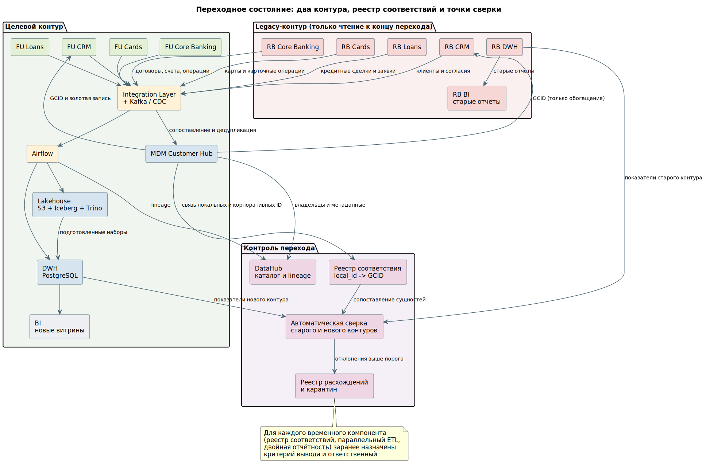

# Образ целевого результата

## 1. Пять вопросов к целевому ландшафту

| Вопрос | Ответ |
|---|---|
| Какие системы остаются | FU Core Banking как единая АБС, FU CRM как единая CRM, FU Card Processing, FU Loan System, MDM Customer Hub, Integration Layer с Kafka и реестром схем, Airflow, DWH, Data Lakehouse на объектном хранилище с Iceberg и Trino, объектное хранилище, графовая БД, поисковый движок, DataHub, выделенный контур управления согласиями |
| Какие выводятся из эксплуатации | RB CRM, RB Core Banking, RB Card Processing, RB Loan System, RB DWH, RB BI, точечные интеграции RetailBank, частичный Data Lake FinUnion (поглощается слоем bronze целевого Lakehouse), локальные витрины и выгрузки обоих банков |
| Какие данные мигрируются | Клиентские записи обоих банков с присвоением GCID; договорной и счётный портфель RetailBank; карточный портфель; кредитный портфель с приведением методики просрочки; история операций двух банков за прошлые годы; обращения; согласия; справочники продуктов, тарифов, отделений и сегментов; архивные выгрузки RB DWH |
| Какие потоки переключаются | F-01 и F-02 клиентского профиля на MDM; F-04 и F-05 с batch-выгрузок на CDC; F-07 и F-08 справочников на единый каталог MDM; F-10 – F-14 аналитической загрузки на целевой DWH и Lakehouse; F-13 BI на новые витрины; F-14 регуляторная отчётность на целевой контур; партнёрские интеграции RetailBank на шину |
| Какие критерии подтверждают завершение перехода | Legacy-контур не обслуживает активную отчётность и не получает новых запросов в течение контрольного периода; все потребители зарегистрированы в каталоге и переключены; сверка показателей старого и нового контуров в значимых разрезах укладывается в согласованные пороги; владельцы данных подтвердили формулы критичных показателей; обязательные данные доступны после отключения источников |

## 2. Что именно меняется за 12 месяцев

### 2.1. Системы

| Система As-Is | Решение | Обоснование |
|---|---|---|
| FU Core Banking | Остаётся, становится единой АБС | Принимающая система выбрана по объёму портфеля и по наличию интеграционной шины, которой у RetailBank нет |
| FU CRM | Остаётся, становится единой CRM | Обе CRM покрывают один домен обслуживания, это кандидат на отключение одной из систем |
| FU Card Processing, FU Loan System | Остаются | Аналогично: принимающая сторона по соответствующим доменам |
| RB Core Banking, RB Cards, RB Loans, RB CRM | Выводятся после миграции портфелей волнами | Одновременная замена всех систем RetailBank исключена ограничением кейса |
| RB DWH, RB BI | Выводятся после переноса отчётности | Отчётность двух банков считается отдельно и метрики не совпадают — это одна из исходных проблем |
| FU DWH | Перестраивается в целевой DWH со слоями staging, core, marts | Текущее хранилище не содержит данных RetailBank и не имеет каталога |
| FU Data Lake | Поглощается слоем bronze целевого Lakehouse | У озера нет единого каталога, lineage и правил качества — оно уже является примером неуправляемого хранилища |
| Новые компоненты | MDM Customer Hub, Kafka, Airflow, Iceberg и Trino, DataHub, контур согласий, графовая БД, поисковый движок | Обоснование по каждому — в Task 3, `target-data-architecture.md` |

### 2.2. Данные

| Группа данных | Объём переноса | Целевое размещение | Особенность переноса |
|---|---|---|---|
| Клиенты обоих банков | Полная база с сопоставлением пересекающихся записей | MDM, реплики в CRM и АБС | Сквозного ключа нет, сопоставление по правилам с порогом уверенности, неоднозначные пары в карантин |
| Согласия | Действующие согласия обоих банков | Контур управления согласиями | Часть согласий RetailBank существует только на бумаге — переносу подлежит то, что зафиксировано в системе, остальное требует повторного получения |
| Справочники продуктов, тарифов, отделений, сегментов | Полностью, с таблицей соответствия кодов | MDM | Сопоставление по экономическому содержанию, а не по совпадению названий |
| Договоры и счета RetailBank | Действующий портфель плюс история закрытых за период хранения | FU Core Banking | Разные модели договора и разные наборы статусов требуют единой статусной модели до переноса |
| Карточный портфель RetailBank | Действующие карты и история операций | FU Cards, история в Lakehouse | Статусы карт двух процессингов не совпадают, нужен словарь соответствия |
| Кредитный портфель RetailBank | Действующие сделки, график, задолженность, отказные заявки | FU Loans | Разные правила расчёта просрочки: до переноса методика приводится к единой, метод расчёта фиксируется атрибутом сделки |
| История операций двух банков | Полная история за период хранения | Lakehouse, слои bronze и silver | Переносится порциями по периодам, исходные коды операций сохраняются в bronze |
| Архивные выгрузки RB DWH | Полностью | Объектное хранилище, далее bronze | Нужны для восстановления происхождения после вывода legacy-систем |
| Обращения | Действующие и закрытые за период хранения | FU CRM, история в DWH | Разные классификаторы тем требуют единого классификатора до переноса |

### 2.3. Переходное состояние

Между As-Is и To-Be существует состояние, в котором работают два контура одновременно. Оно должно отвечать на четыре вопроса, и ответы фиксируются до начала первой волны:

| Вопрос переходного состояния | Ответ для этого проекта |
|---|---|
| Какая система является мастером для каждой группы записей или атрибутов | Разделение по атрибутам для клиента: MDM ведёт идентифицирующие поля и GCID, CRM каждого банка — контактные данные своих клиентов. Разделение по записям для учётных сущностей: каждая АБС остаётся мастером своих договоров и счетов до завершения соответствующей волны. Матрица владения — в Task 2, `master-systems.md` |
| Как передаются изменения и сопоставляются идентификаторы | Через шину и Kafka, сопоставление в реестре соответствия `local_id → GCID`. В целевую модель на переходный период добавляются атрибуты `legacy_id` и `legacy_status` |
| Какие потребители уже используют новый источник | Переключение идёт группами: сначала пилотный регион, затем управленческая отчётность, затем регуляторная. Реестр потребителей ведётся в каталоге и пополняется по результатам анализа журналов запросов |
| По каким критериям этап завершается и временные компоненты выводятся | Для каждого временного компонента назначены критерий вывода и ответственный. Без этого реестр соответствий и параллельный ETL остаются в архитектуре на годы |

Временные компоненты перехода и условия их вывода:

| Временный компонент | Зачем нужен | Критерий вывода | Ответственный |
|---|---|---|---|
| Реестр соответствия `local_id → GCID` | Связь локальных идентификаторов двух банков с корпоративным | Legacy-системы отключены, локальные идентификаторы больше не используются ни одним потребителем | Data Office |
| Двойная отчётность и автоматическая сверка контуров | Подтверждение корректности нового контура | Три отчётных периода подряд без отклонений выше порога | Финансовый департамент |
| Параллельный ETL из RB DWH | Питание старых отчётов на период перехода | Все потребители RB DWH переключены, журнал запросов пуст контрольный период | Команда платформы данных |
| Атрибуты `legacy_id` и `legacy_status` в целевой модели | Трассировка до источника в переходный период | Legacy-системы выведены, история перенесена и сверена | Архитектор данных |
| Маршрутизация запросов между старым и новым мастером | Постепенное вытеснение старой системы без доработки потребителей | Все записи домена переведены на новый мастер | Команда интеграции |

## 3. Критерии завершения перехода

Критерии разделены на два потока, потому что технически выполненная миграция может быть не принята бизнесом, а согласованные владельцами показатели могут не иметь подтверждения полноты загрузки.

| Область | Технический результат | Управленческий результат |
|---|---|---|
| Сопоставление клиентов | Доля клиентских записей с присвоенным GCID выше согласованного порога, неразрешённые пары изолированы | Владельцы клиентских данных подтвердили правила сопоставления и разобрали карантин |
| Справочники | Нет дублей по коду продукта, тарифа, отделения и сегмента | Продуктовые подразделения подтвердили таблицу соответствия линеек двух банков |
| Портфели | Расхождение по количеству и суммам между legacy и целевым контуром в пределах порога в разрезах по продукту, региону и периоду | Финансовый департамент и риск-менеджмент подтвердили допустимость каждого зарегистрированного отклонения |
| Загрузка | Пайплайны укладываются в SLA, повторный запуск не создаёт дубли | Потребители согласны с частотой обновления витрин |
| Отчётность | Регуляторные формы формируются из целевого контура и проходят двойную сверку | Владелец отчётности дал решение о переключении |
| Legacy-контур | Нет запросов к старым системам в течение контрольного периода по журналам подключений | Владельцы всех выявленных потребителей подтвердили переход |

Отдельно фиксируется правило: завершение этапа не привязывается к календарной дате. Дата задаёт ориентир, решение принимается по полноте данных, результатам сверки, готовности поддержки и подтверждению владельца.
